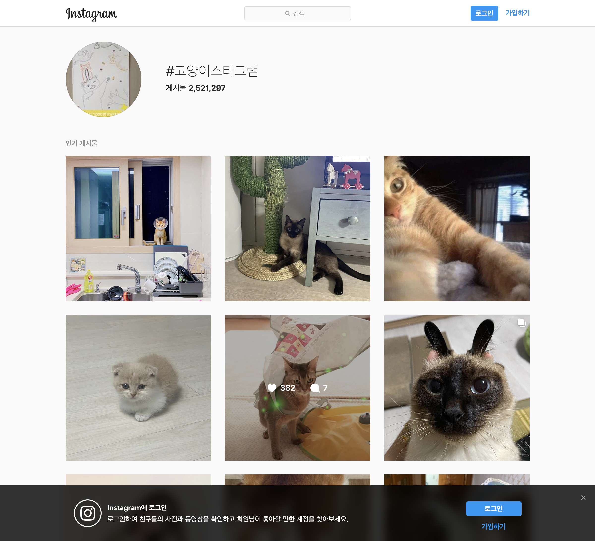

# Crawling 

> 13기 조상연

## 준비


```python
!pip install requests bs4 selenium pandas
```

    Requirement already satisfied: requests in /Users/josang-yeon/tobigs/lib/python3.7/site-packages (2.22.0)
    Requirement already satisfied: bs4 in /Users/josang-yeon/tobigs/lib/python3.7/site-packages (0.0.1)
    Requirement already satisfied: selenium in /Users/josang-yeon/tobigs/lib/python3.7/site-packages (3.141.0)
    Requirement already satisfied: pandas in /Users/josang-yeon/tobigs/lib/python3.7/site-packages (1.0.0rc0)
    Requirement already satisfied: certifi>=2017.4.17 in /Users/josang-yeon/tobigs/lib/python3.7/site-packages (from requests) (2019.11.28)
    Requirement already satisfied: chardet<3.1.0,>=3.0.2 in /Users/josang-yeon/tobigs/lib/python3.7/site-packages (from requests) (3.0.4)
    Requirement already satisfied: urllib3!=1.25.0,!=1.25.1,<1.26,>=1.21.1 in /Users/josang-yeon/tobigs/lib/python3.7/site-packages (from requests) (1.25.7)
    Requirement already satisfied: idna<2.9,>=2.5 in /Users/josang-yeon/tobigs/lib/python3.7/site-packages (from requests) (2.8)
    Requirement already satisfied: beautifulsoup4 in /Users/josang-yeon/tobigs/lib/python3.7/site-packages (from bs4) (4.6.0)
    Requirement already satisfied: pytz>=2017.2 in /Users/josang-yeon/tobigs/lib/python3.7/site-packages (from pandas) (2019.3)
    Requirement already satisfied: numpy>=1.13.3 in /Users/josang-yeon/tobigs/lib/python3.7/site-packages (from pandas) (1.18.1)
    Requirement already satisfied: python-dateutil>=2.6.1 in /Users/josang-yeon/tobigs/lib/python3.7/site-packages (from pandas) (2.8.1)
    Requirement already satisfied: six>=1.5 in /Users/josang-yeon/tobigs/lib/python3.7/site-packages (from python-dateutil>=2.6.1->pandas) (1.13.0)
    WARNING: You are using pip version 20.1.1; however, version 20.2.2 is available.
    You should consider upgrading via the '/Users/josang-yeon/tobigs/bin/python -m pip install --upgrade pip' command.


```python
import requests
import pandas as pd
```

## 0. 기초

### 0.1. 기본적인 웹 통신 이해하기

> 강의 자료 참고

### 0.2. HTML 문서 이해하기


```python
from IPython import display
```


```python
display.HTML("""
<style>
div > p { color: black }
#hi { color: blue }
.green { color: green }
[value="3"] { color: grey }
</style>
<div>
    <h5>Hello, world!</h5>
    <p class="green">안녕하세요</p>
    <p>안녕하세요</p>
    <p id="hi">안녕하세요</p>
    <p class="green">안녕하세요</p>
    <p value="3">안녕하세요</p>
</div>
""")
```


<style>
div > p { color: black }
#hi { color: blue }
.green { color: green }
[value="3"] { color: grey }
</style>
<div>
    <h5>Hello, world!</h5>
    <p class="green">안녕하세요</p>
    <p>안녕하세요</p>
    <p id="hi">안녕하세요</p>
    <p class="green">안녕하세요</p>
    <p value="3">안녕하세요</p>
</div>


### 0.3. Requests 활용 기본 크롤링

1. Method 확인
2. 필요한 부품 (URL, Params, Header, Data) 체크
3. 결과 확인 및 오류 시 2번 사항 반복 체크
4. 결과 형식에 따라 파싱

#### 0.3.1. GET 방식


```python
res = requests.get("https://search.naver.com/search.naver?where=news&sm=tab_jum&query=테넷")
res
```


    <Response [200]>


```python
res.text[:500]
```


    '<!doctype html> <html lang="ko"> <head> <meta charset="utf-8"> <meta name="referrer" content="always">  <meta name="format-detection" content="telephone=no,address=no,email=no"> <meta name="viewport" content="width=device-width,initial-scale=1.0,maximum-scale=2.0"> <meta property="og:title" content="테넷 : 네이버 뉴스검색"/> <meta property="og:image" content="https://ssl.pstatic.net/sstatic/search/common/og_v3.png"> <meta property="og:description" content="\'테넷\'의 네이버 뉴스검색 결과입니다."> <meta name="description"'


기본적으로 URL에 Params를 넣어도 동작하지만 더 나은 방식을 위해 아래와 같이 활용해보자!


```python
# URL
def get_news_search_result(keword):
    url = "https://search.naver.com/search.naver"
    
    # Parameter -> Query가 됨 https://search.naver.com/search.naver?where=news&sm=tab_jum&query=테넷
    my_params = {'where': 'news', 
              'sm': 'tab_jum', 
              'query': keword}

    # Headers 설정
    my_headers = {
        "referer": "https://www.tobigs.com"
    }

    # 전송
    res = requests.get(url, params=my_params, headers=my_headers)
    return res # 상태코드 200으로 성공
```


```python
res.text[:500] # 결과
```


    '<!doctype html> <html lang="ko"> <head> <meta charset="utf-8"> <meta name="referrer" content="always">  <meta name="format-detection" content="telephone=no,address=no,email=no"> <meta name="viewport" content="width=device-width,initial-scale=1.0,maximum-scale=2.0"> <meta property="og:title" content="테넷 : 네이버 뉴스검색"/> <meta property="og:image" content="https://ssl.pstatic.net/sstatic/search/common/og_v3.png"> <meta property="og:description" content="\'테넷\'의 네이버 뉴스검색 결과입니다."> <meta name="description"'


#### 0.3.2. POST 방식


```python
url = "https://api.everytime.kr/find/lecture/article/list"
```


```python
import requests

url = "https://api.everytime.kr/find/lecture/article/list"

payload = {
    'school_id': 9, 
    'limit_num':200,
    'lecture_id': 1688764}

headers = {
  'Cookie': '_ga=GA1.2.168813388.1596099998; _gid=GA1.2.1403299065.1597760084; _gat_gtag_UA_22022140_4=1; etsid=',
  'Content-Type': 'application/x-www-form-urlencoded'}

response = requests.post(url, headers=headers, data = payload)
```


```python
print(response.text[:500])
```

    <?xml version="1.0" encoding="UTF-8"?>
    <response lectureId="1688764">
      <lecture name="컴퓨터네트웍개론" professor="김유성" campus=""/>
      <rate>4.55</rate>
      <details assessment_grade="학점느님" assessment_homework="보통" assessment_team="없음" assessment_attendance="전자출결" exam_times="두 번"/>
      <semesters>
        <semester year="2020" semester="2"/>
        <semester year="2020" semester="1"/>
        <semester year="2019" semester="2"/>
        <semester year="2018" semester="2"/>
        <semester year="2018" semester="1"/>
        <se


## 1. 초급

### 1.0. JSON 형식


```python
import json
```


```python
url = "https://www.timeshighereducation.com/sites/default/files/the_data_rankings/world_university_rankings_2020_0__24cc3874b05eea134ee2716dbf93f11a.json"
headers = {
    'user-agent': 'Mozilla/5.0 (Macintosh; Intel Mac OS X 10_15_4) AppleWebKit/537.36 (KHTML, like Gecko) Chrome/84.0.4147.125 Safari/537.36',
    'cookie': 'geoCountry=KR; siteCountry=GB; has_js=1; Drupal.visitor.the_user=%7B%22show_menu%22%3A0%2C%22user_closed%22%3A0%7D; __tesu=6765b049-1b8b-4cec-bc92-de35818b600d; _ga=GA1.2.1649170199.1597508290; _fbp=fb.1.1597508290544.2090481780; __gads=ID=92b9981fb38f9252'
}
response = requests.get(url, headers=headers)
result = response.json()

response

df_univ_ranking = pd.json_normalize(result["data"])
```


```python
df_univ_ranking.head(5)
```


<div>
<style scoped>
    .dataframe tbody tr th:only-of-type {
        vertical-align: middle;
    }

    .dataframe tbody tr th {
        vertical-align: top;
    }

    .dataframe thead th {
        text-align: right;
    }
</style>
<table border="1" class="dataframe">
  <thead>
    <tr style="text-align: right;">
      <th></th>
      <th>rank_order</th>
      <th>rank</th>
      <th>name</th>
      <th>scores_overall</th>
      <th>scores_overall_rank</th>
      <th>scores_teaching</th>
      <th>scores_teaching_rank</th>
      <th>scores_research</th>
      <th>scores_research_rank</th>
      <th>scores_citations</th>
      <th>...</th>
      <th>url</th>
      <th>nid</th>
      <th>location</th>
      <th>stats_number_students</th>
      <th>stats_student_staff_ratio</th>
      <th>stats_pc_intl_students</th>
      <th>stats_female_male_ratio</th>
      <th>aliases</th>
      <th>subjects_offered</th>
      <th>apply_link</th>
    </tr>
  </thead>
  <tbody>
    <tr>
      <th>0</th>
      <td>10</td>
      <td>1</td>
      <td>University of Oxford</td>
      <td>95.4</td>
      <td>10</td>
      <td>90.5</td>
      <td>6</td>
      <td>99.6</td>
      <td>1</td>
      <td>98.4</td>
      <td>...</td>
      <td>/world-university-rankings/university-oxford</td>
      <td>468</td>
      <td>United Kingdom</td>
      <td>20,664</td>
      <td>11.2</td>
      <td>41%</td>
      <td>46 : 54</td>
      <td>牛津大学</td>
      <td>Mechanical &amp; Aerospace Engineering,Computer Sc...</td>
      <td>https://www.timeshighereducation.com/cn/studen...</td>
    </tr>
    <tr>
      <th>1</th>
      <td>20</td>
      <td>2</td>
      <td>California Institute of Technology</td>
      <td>94.5</td>
      <td>20</td>
      <td>92.1</td>
      <td>2</td>
      <td>97.2</td>
      <td>4</td>
      <td>97.9</td>
      <td>...</td>
      <td>/world-university-rankings/california-institut...</td>
      <td>128779</td>
      <td>United States</td>
      <td>2,240</td>
      <td>6.4</td>
      <td>30%</td>
      <td>34 : 66</td>
      <td>California Institute of Technology caltech</td>
      <td>Biological Sciences,Mechanical &amp; Aerospace Eng...</td>
      <td>NaN</td>
    </tr>
    <tr>
      <th>2</th>
      <td>30</td>
      <td>3</td>
      <td>University of Cambridge</td>
      <td>94.4</td>
      <td>30</td>
      <td>91.4</td>
      <td>4</td>
      <td>98.7</td>
      <td>2</td>
      <td>95.8</td>
      <td>...</td>
      <td>/world-university-rankings/university-cambridge</td>
      <td>470</td>
      <td>United Kingdom</td>
      <td>18,978</td>
      <td>10.9</td>
      <td>37%</td>
      <td>47 : 53</td>
      <td>剑桥大学</td>
      <td>Languages, Literature &amp; Linguistics,Computer S...</td>
      <td>https://www.timeshighereducation.com/cn/studen...</td>
    </tr>
    <tr>
      <th>3</th>
      <td>40</td>
      <td>4</td>
      <td>Stanford University</td>
      <td>94.3</td>
      <td>40</td>
      <td>92.8</td>
      <td>1</td>
      <td>96.4</td>
      <td>5</td>
      <td>99.9</td>
      <td>...</td>
      <td>/world-university-rankings/stanford-university</td>
      <td>467</td>
      <td>United States</td>
      <td>16,135</td>
      <td>7.3</td>
      <td>23%</td>
      <td>43 : 57</td>
      <td>Stanford University</td>
      <td>Archaeology,Physics &amp; Astronomy,Law,General En...</td>
      <td>NaN</td>
    </tr>
    <tr>
      <th>4</th>
      <td>50</td>
      <td>5</td>
      <td>Massachusetts Institute of Technology</td>
      <td>93.6</td>
      <td>50</td>
      <td>90.5</td>
      <td>5</td>
      <td>92.4</td>
      <td>10</td>
      <td>99.5</td>
      <td>...</td>
      <td>/world-university-rankings/massachusetts-insti...</td>
      <td>471</td>
      <td>United States</td>
      <td>11,247</td>
      <td>8.6</td>
      <td>34%</td>
      <td>39 : 61</td>
      <td>Massachusetts Institute of Technology</td>
      <td>Veterinary Science,Languages, Literature &amp; Lin...</td>
      <td>NaN</td>
    </tr>
  </tbody>
</table>
<p>5 rows × 27 columns</p>
</div>


```python
# df_univ_ranking.to_json("univ_rank_2020.json")
# df_univ_ranking.to_json("univ_rank_2020.json",orient="records")
```

### 1.1. BeautifulSoup를 이용한 HTML 파싱


```python
from bs4 import BeautifulSoup
```


```python
res = get_news_search_result("코로나")
if res.status_code == 200: print("OK!")
```

    OK!


```python
soup = BeautifulSoup(res.text, "html.parser")
```


```python
[
    dl.select("a._sp_each_title")[0]["title"].strip()
    for dl 
    in soup.select("dl")[2:-1]
]
```


    ["'광화문 집회 참석' 차명진 전 의원 코로나19 확진(종합)",
     "이낙연, 코로나19 검사 '음성'…일정 재개는 미정(종합)",
     '해외유입 코로나확진자 예측하는 AI 나왔다',
     "'광화문 집회 참석' 차명진 전 의원 코로나19 확진",
     '이낙연, 코로나19 \'음성\' 판정…"모두를 위해 다행"(종합)',
     '나훈아, 20일 신곡 발표 "코로나로 삭막한 세상...해학 담아" [공식]',
     "[단독] 철원 신병교육대에서 코로나 '양성' 나와",
     '코로나19 전국 확산에 “해수욕장 이용 자제”',
     "이낙연, 코로나19 '음성'…정치권 안도(종합)",
     '동화약품, 코로나19 치료제 임상2상 시험 신청']


### 1.2. 셀레니움 활용 크롤링

**셀레니움 이란**

- 원래 웹 테스팅 용도로 개발
- 그러다보니 웹에서 하는 모든 행위를 다 할 수 있음
- 이러한 기능을 통해 크롤링이 힘들거나 어려운 사이트를 노가다를 통해 크롤링 할 수 있게함

**셀레니움 동작 순서**

1. driver 파일을 다운로드 받고 노트북 파일과 같은 위치에 넣어준다.
2. `driver = webdriver.Chrome(드라이버 경로)`를 통해 드라이버를 불러온다.
    2.1. 이때 안보이게 하고 싶다면 headless 옵션을 이용한다.
3. 해당 드라이버가 켜진 것을 확인
4. `driver.get(URL)`을 이용해 원하는 페이지로 이동한다.
5. `driver.find_element[s]_by_css_selector` 를 이용하여 원하는 부분을 찾는다.

    5.0. 찾은 결과는 element이며 element.text를 통해 안 내용을 불러올 수 있다.
    
    5.1. `element.send_keys(원하는 내용,ID,PW)`을 통해 값을 입력할 수 있다.
    
    5.2. `element.click()`을 통해 버튼 등을 클릭할 수 있다.
    
6. `driver.page_source`를 통해 전체 페이지 내용을 불러올 수 있다.

    6.1. 만약 소스에 내가 원하는 내용이 없다면 iframe에 있을 가능성이 있다.
    
    6.2. 이러한 경우 `driver.switch_to.frame(해당 ifram element)`로 이동한다.
    
    6.3. Alert, 다른 창으로 열기 등 다양한 변수에 대해서도 `driver.switch_to`로 대응이 가능
    
7. `driver.close()`로 해당 드라이버를 종료한다.


```python
from selenium import webdriver
from IPython.display import Image
import os
from pathlib import Path
import glob
```

#### 1.2.0. 이미지 보기 꿀팁


```python
python_image_url = "https://www.python.org/static/img/python-logo.png"
Image(python_image_url)
```


#### 1.2.1. 셀레니움 기본 실행


```python
print(f"Directory Path: {Path().absolute()}") 
```

    Directory Path: /Users/josang-yeon/Downloads/week4_Ensemble_yjlee


```python
glob.glob("chrome*") # 현재 폴더 내 크롬 드라이버 명 확인
```


    ['chromedriver_win.exe', 'chromedriver_linux', 'chromedriver_mac']


```python
driver_path = os.path.join(Path().absolute(),  "chromedriver_mac") # 본인 운영체제에 맞게 바꿔줘야함
```


```python
driver = webdriver.Chrome(driver_path)
driver.get("https://www.naver.com")
```


```python
driver.quit()
```

#### 1.2.2. Headless 옵션 주기


```python
from selenium.webdriver.chrome.options import Options

options = Options()
options.headless = True # True면 창이 안뜸
driver = webdriver.Chrome(driver_path, options=options)
```


```python
# driver.set_window_size(1920, 1080)
```


```python
# Image(driver.get_screenshot_as_png())
```


```python
# driver.quit()
# options.headless = False # True면 창이 안뜸
# driver = webdriver.Chrome(driver_path, options=options)

driver.get("https://www.coupang.com/np/search?q=%EB%8B%8C%ED%85%90%EB%8F%84%20%EC%8A%A4%EC%9C%84%EC%B9%98&channel=recent")
```


```python
Image(driver.get_screenshot_as_png())
```


```python
driver.execute_script("return navigator.userAgent")
```


```python
[
    [element.find_element_by_css_selector("div.name").text, element.find_element_by_css_selector("strong.price-value").text]
    for element 
    in driver.find_elements_by_css_selector(".search-product-link")
][:5]
```


    [['호환용 닌텐도스위치 프로컨트롤러 프로컨 프로콘, 1개, 8번 IINE정품핑크캣', '51,900'],
     ['정품 닌텐도 스위치 본체 배터리 개선판, 배터리 개선판 네온', '487,500'],
     ['닌텐도스위치라이트 본체 터콰이즈 + 스타터킷 액세서리 6종 세트, HDH-001', '269,000'],
     ['닌텐도 스위치 동물의숲 에디션 한글 동물의 숲 배터리개선판 신품, 닌텐도 스위치 HAD 신형 동물의숲 에디션 한글 동물의 숲 에디션 새제품',
      '535,000'],
     ['쵸미앤세븐 닌텐도 스위치 스타터 악세서리 패키지 4종 D세트, 단일 상품, 1세트', '13,500']]


> BeautifulSoup를 이용한 다른 방법


```python
soup = BeautifulSoup(driver.page_source, "html.parser")
```


```python
[
    element.text.strip()
    for element in soup.select(".search-product-link")
][:5]
```


    ['광고   |  무료배송 호환용 닌텐도스위치 프로컨트롤러 프로컨 프로콘, 1개, 8번 IINE정품핑크캣  \n \n51,900원     \n 8/27   도착 예정   \n5.0 (10)  최대 2,595원 적립',
     '무료배송 정품 닌텐도 스위치 본체 배터리 개선판, 배터리 개선판 네온  \n \n487,500원     \n 모레(금) 8/21   도착 예정   \n5.0 (38)  최대 24,375원 적립 1',
     '닌텐도스위치라이트 본체 터콰이즈 + 스타터킷 액세서리 6종 세트, HDH-001  \n \n269,000원  \n         \n  \n 내일(목) 8/20   도착 보장  \n    내일(목) 새벽   도착 보장  \n \n5.0 (44)  최대 13,450원 적립 2',
     '닌텐도 스위치 동물의숲 에디션 한글 동물의 숲 배터리개선판 신품, 닌텐도 스위치 HAD 신형 동물의숲 에디션 한글 동물의 숲 에디션 새제품  \n \n535,000원     \n 모레(금) 8/21   도착 예정   \n5.0 (39)  최대 26,750원 적립 3',
     '광고    쵸미앤세븐 닌텐도 스위치 스타터 악세서리 패키지 4종 D세트, 단일 상품, 1세트  \n \n13,500원  \n         \n  \n 내일(목) 8/20   도착 보장  \n    내일(목) 새벽   도착 보장  \n \n4.5 (98)  최대 675원 적립']


#### 1.2.3. 실전! 인스타그램 크롤링


```python
driver.get("https://www.instagram.com/explore/tags/고양이스타그램")
```


```python
# Image(driver.get_screenshot_as_png(), width=500)
```


```python
MAX_HEIGHT = 2000000
driver.execute_script(f"window.scrollTo(0,{MAX_HEIGHT})")
```


```python
Image(driver.get_screenshot_as_png(), width=500)
```





```python
len(elements)
```


    45


```python
soup = BeautifulSoup(driver.page_source,"html.parser")
elements = soup.select("div.v1Nh3.kIKUG._bz0w")
```


```python
len(elements)
```


    45


```python
driver.find_element_by_css_selector('input[name="username"]').send_keys("myId")
driver.find_element_by_css_selector('input[name="password"]').send_keys("mypassword")
driver.find_element_by_css_selector('button[type="submit"]').click()
```


```python
driver.close()
```

## 2. 중급

### 2.1. 동적 웹사이트 XHR 크롤링


```python
res = requests.get("https://www.instagram.com/explore/tags/%EA%B3%A0%EC%96%91%EC%9D%B4%EC%8A%A4%ED%83%80%EA%B7%B8%EB%9E%A8/?__a=1")
```


```python
def find_by_path(path, target_json):
    path_arr = path.split(".")
    while path_arr:
        target_json = target_json.get(path_arr.pop(0), {})
        
    if not target_json: raise Exception("해당 값이 없습니다.")
    return target_json 
```


```python
a = response.json()
target_nodes = find_by_path("graphql.hashtag.edge_hashtag_to_media.edges", a)
top_nodes = find_by_path("graphql.hashtag.edge_hashtag_to_top_posts.edges", a)
END_CURSOR_PATH = "graphql.hashtag.edge_hashtag_to_media.page_info.end_cursor"
```


```python
end_cursor = find_by_path(END_CURSOR_PATH, a)
```


```python
end_cursor
```


    'QVFCZFJBUkNPSklTbjBOWEVIWkM0c042ZGgxcC1XTkVsZjR2VXFibHk0ZExzeVhUM1VIVzlqMzgwSGZIUzNmaG5WbDZ1YWN0X2h1U0VXczk5ZlltZ21QZg=='


```python
url = "https://www.instagram.com/graphql/query/?query_hash=c769cb6c71b24c8a86590b22402fda50&variables={\"tag_name\":\"고양이스타그램\",\"first\":12,\"after\":\""+end_cursor+"\"}"
payload = {}
headers = {
  'Cookie': 'ig_did=656729E2-6F50-459C-982B-FB916EE97A25; csrftoken=hpAOmbp8QMG0cbqK4gLyZfpElSQ3XoRZ; rur=ASH; mid=XzwTTgAEAAEDAPtxIV4NSHR9nuPQ; urlgen="{\\"59.6.24.240\\": 4766}:1k85f1:yjpBnLz3E2eAs58BSNlDtdmt284"'
}

response = requests.request("GET", url, headers=headers, data = payload)
```


```python
response
```


    <Response [200]>


```python
# response.json()
```


```python
# pd.json_normalize(top_nodes)
```

### 2.2. GraphQL 크롤링

사실 2.1. 이 GraphQL이다. 이건 패스

### 2.3. 빠른 속도를 위한 멀티프로세싱 & 멀티쓰레딩 크롤링


```python
driver.get("https://finance.naver.com/marketindex/exchangeDetail.nhn?marketindexCd=FX_USDKRW")
soup = BeautifulSoup(driver.page_source, "html.parser")
driver.switch_to.frame(driver.find_element_by_css_selector("iframe[title='고시회차별 시세']"))

# Image(driver.get_screenshot_as_png())
soup = BeautifulSoup(driver.page_source, "html.parser")
soup.select("body > div > table")[0].select("td")[0].text
```


```python
import concurrent.futures
from multiprocessing import Pool
```


```python
from time import time
import functools

def timer(func):
    @functools.wraps(func)
    def wrapper(*args, **kwargs):
        start = time()
        ret = func(*args, **kwargs)
        print(f"실행시간: {time()-start:0.5f}초")
        return ret
    return wrapper
```


```python
def get_ex_usd_by_page(n):
    try:
        return pd.read_html(f"https://finance.naver.com/marketindex/exchangeDailyQuote.nhn?marketindexCd=FX_USDKRW&page={n}")[0]
    except:
        print("error")
    
@timer
def get_all_usd_single(N):
    return pd.concat([get_ex_usd_by_page(i) for i in range(1,N)])

@timer
def get_all_usd_by_multi_threads(N):
    nums = list(range(1,N))
    with concurrent.futures.ThreadPoolExecutor(max_workers=40) as executor:
        d = executor.map(get_ex_usd_by_page, nums)
    return pd.concat(d)

@timer
def get_all_usd_by_multi_processes(N):
    nums = list(range(1,N))
    pool = Pool(processes=2) # 2개의 프로세스를 사용합니다.
    return pd.concat(pool.map(get_ex_usd_by_page, nums)) # get_contetn 함수를 넣어줍시다.
```


```python
df_1 = get_all_usd_single(50)
print(df_1.shape)

df_2 = get_all_usd_by_multi_threads(50)
print(df_2.shape)

df_3 = get_all_usd_by_multi_processes(50)
print(df_3.shape)
```

    실행시간: 7.45321초
    (490, 9)
    실행시간: 1.15378초
    (490, 9)
    실행시간: 4.33059초
    (490, 9)


## 3. 고급

### 3.1. Session 인증, 암호화 크롤링

### 3.2. 서버사이드렌더링 크롤링

### 3.3. 리다이렉션 및 Breakpoint 활용 크롤링

### 3.4. 스마트폰 앱 데이터 크롤링

## 4. 응용

### 4.1. openGraph 정보 활용하기

### 4.2. 간단한 캡챠 뚫기

### 4.3. Crontab을 이용한 크롤링 자동화

### 4.4. 이미지, 비디오 파일 다운로드 받기

### 4.5. 데이터 저장 최적화
