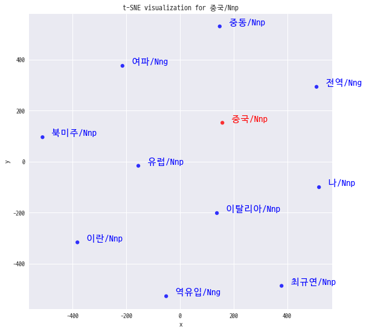

# NLP 기초 

1. 파일로 제공되는 정형 데이터가 아닌, ‘크롤링’으로 데이터를 수집해주세요.
2. 임베딩 모델을 2개 이상 적용해본 후, Step5의 결과에 따라 가장 좋은 모델을 선택해주세요.
    - ex) CBOW, Skip-gram, GloVe, NN, FastText 등
3. RNN, LSTM 등 모델링을 하는 것이 아니기 때문에 이번 과제에서는 텍스트를 전처리,
    - 토크나이징, 임베딩 후 인사이트를 도출하는 경험이 중요합니다.
    - 주석 꼭 꼼꼼하게 달아주시고 데이터가 자유인만큼 참신한 인사이트 찾아주세요!

# 1. Data Crawling

데이터는 뉴스 빅데이터를 제공해주는 빅카인즈를 통해 크롤링을 진행하였다. 
데이터의 종류는 중앙지 전체의 [정치, 경제, 사회, 문화, IT] 분야 분석기사를 수집하였다.
기간은 최근 3개월로 약 2만여건의 뉴스 기사를 수집하고 이를 기반으로 문장별 전처리, 토크나이징을 진행하였다.

데이터 소스: https://www.bigkinds.or.kr/ 


```python
import requests
import json
import pandas as pd
import numpy as np
import jsonlines
import re
import pprint
```


```python
NEWS_LIST_URL = "https://www.bigkinds.or.kr/api/news/search.do"
NEWS_LIST_PAYLOAD = {"indexName":"news",
           "searchKey":"",
           "searchKeys":[{}],
           "byLine":"",
           "searchFilterType":"1",
           "searchScopeType":"1",
           "searchSortType":"date",
           "sortMethod":"date",
           "mainTodayPersonYn":"",
           "startDate":"2019-12-22",
           "endDate":"2020-03-22",
           "newsIds":None,
           "categoryCodes":["001000000","001005000","001001000","001004000","001003000","001007000","001002000","001006000","002000000","002004000","002010000","002008000","002014000","002011000","002009000","002005000","002001000","002012000","002006000","002002000","002007000","002003000","002013000","003000000","003007000","003003000","003006000","003002000","003009000","003001000","003005000","003010000","003008000","003004000","004000000","004002000","004011000","004006000","004003000","004007000","004010000","004004000","004008000","004001000","004009000","004005000","008000000","008005000","008001000","008004000","008003000","008006000","008002000"],
           "providerCodes":["01100101","01100201","01100301","01100401","01100501","01100611","01100701","01100801","01100901","01101001","01101101"],
           "incidentCodes":[],
           "networkNodeType":"",
           "topicOrigin":"",
           "dateCodes":[],
           "startNo":1,
           "resultNumber":"1000",
           "isTmUsable":True,
           "isNotTmUsable":False}

NEWS_LIST_HEADERS = {
  'Content-Type': 'application/json'
}

def get_news_list_by_index(start_index=1, result_len=1000):
    NEWS_LIST_PAYLOAD.update({"startNo":start_index, "resultNumber":str(result_len)})
    response = requests.request("POST", 
                                NEWS_LIST_URL, 
                                headers=NEWS_LIST_HEADERS, 
                                data = json.dumps(NEWS_LIST_PAYLOAD))
    return response.json()


def get_news_detail(NEWS_ID):
    url = f"https://www.bigkinds.or.kr/news/detailView.do?docId={NEWS_ID}&returnCnt=1"
    response = requests.request("GET", url)
    return response.json()

def write_jsonl(JSON_ARR, filename='output.jsonl'):
    with jsonlines.open(filename, mode='a') as writer:
        writer.write_all(JSON_ARR)
```


```python
dfArr = []
for i in range(1,101):
    result = get_news_list_by_index(i)
    dfArr.append(pd.json_normalize(result["resultList"]))
```


```python
# result['totalCount']
```


```python
df_total = pd.concat(dfArr)
```


```python
df_total.shape
```


    (55000, 22)


```python
df_total.reset_index(drop=True, inplace=True)
```


```python
# 기사 데이터 jsonl 형식으로 저장
json_arr = []
for i, news_id in df_total.NEWS_ID.items():
    if news_id:
        res = get_news_detail(news_id)
        json_arr.append(res['detail'])
    if i % 100 == 0:
        print(i)
        write_jsonl(json_arr, 'result.jsonl')
        json_arr = []
```


```python
df_total.NEWS_ID.unique().shape
```


    (21269,)


```python
# 저장된 기사 데이터 불러오기
content_arr = []
with jsonlines.open('result.jsonl') as reader:
    results = (obj for obj in reader.iter(type=dict, skip_invalid=True))
    for result in results:
        content_arr.append(result['CONTENT'])
```


```python
text_arr = content_arr[:25000]
```


```python
# 기사 본문 데이터 25000개 
text_arr[:5]
```


    ["김여정 북한 노동당 제1부부장이 도널드 트럼프 미국 대통령이 김정은 위원장에게 친서를 보내와 코로나19 방역에 힘을 합치고 싶다는 뜻을 전달했다고 22일 밝혔다.<br/>김 제1부부장은 이날 담화를 발표해 “<span class='quot0'>우리는 김정은 국무위원장 동지에게 보내온 도날드 트럼프 미합중국 대통령의 친서를 받았다</span>”고 밝혔다고 조선중앙통신이 전했다. 김정은 위원장의 친동생인 김 부부장은 “<span class='quot0'>트럼프 대통령이 친서에서 북미관계를 추동하기 위한 구상을 설명하고 전염병 사태의 심각한 위협으로부터 인민을 보호하고자 힘쓰는 국무위원장의 노력에 감동을 피력하면서 비루스(바이러스) 방역에서 협조할 의향도 표시했다</span>”고 말했다.<br/>이어 “트럼프 대통령이 김 위원장과 최근 의사소통을 자주 하지 못해 자신의 생각을 알리는데 어려움이 있었다는 데 대해 언급하면서 앞으로 국무위원장과 긴밀히 연계해 나가기 바란다는 뜻을 전해왔다”고 소개했다.<br/>김 제1부부장은 다만 “<span class='quot0'>북미관계와 발전은 두 수뇌 사이의 개인적 친분을 놓고 섣불리 평가하고 전망, 기대해서는 더 안 된다</span>”면서 “<span class='quot0'>공정성과 균형이 보장되지 않고 일방적이며 과욕적인 생각을 거두지 않는다면 두 나라의 관계는 계속 악화일로에로 줄달음칠 것</span>”이라고 덧붙였다.<br/>한편 김여정 부부장은 지난 10일 북한의 지난 3일 발사체 발사에 우려를 표한 청와대를 겨냥해 “<span class='quot1'>저능한 사고 방식에 경악을 표한다</span>”는 담화를 처음 발표해 정치적 위상이 많이 올라갔다는 분석을 낳았다. 통일부 관계자는 “<span class='quot2'>김 제1부부장의 보직과 관련, 북한의 공식 직함은 노동당 제1부부장이고 그 이전에 선전선동부로 확인한 바 있는데 (지난해 2월) 하노이 북미 정상회담 이후 김여정의 활동이 파악되지 않다가 6·30 판문점 회동에 나왔고 최근에 부각되고 있다</span>”면서 “<span class='quot2'>소속이 조직지도부일지 선전선동부일지, 기타일지에 대해선 전문가 의견 등 관련 관계 기관의 의견을 종합해 면밀히 보고자 한다</span>”고 말한 일이 있다.<br/>임병선 평화연구소 사무국장 bsnim@seoul.co.kr", '이탈리아에서 코로나19로 인해 하루 동안 800명 가까이가 숨졌다. 스페인도 하루 사망자가 300명 이상 급증했다.<br/>이탈리아 보건당국은 21일 오후 6시(이하 현지시간) 기준으로 전국 누적 사망자가 4825명으로 집계됐다고 밝혔다. 전날보다 793명이 늘어나 하루 기준 증가 인원이 또다시 최대를 기록했다. 누적 확진자도 6557명이 늘어 5만 3578명으로 잠정 파악됐다. 하루 신규 확진자가 6000명을 넘긴 것도 처음이다.<br/>누적 확진자 대비 누적 사망자를 나타내는 치명률도 전날보다 0.5%포인트 상승해 9.0%에 이르렀다. 확진 판정을 받은 100명 가운데 9명은 세상을 등진다는 얘기다. 한국(1.16%)의 아홉 배에 가깝다.<br/>누적 사망자와 완치자(6072명)를 뺀 실질 확진자는 4만 2681명이다. 이 가운데 2857명은 중증 환자로 분류된다. 전날보다 202명 늘었다.<br/>스페인 보건당국은 사망자가 전날보다 324명 늘어 1326명이 됐다고 발표했다. 확진자도 하루 동안 4946명이 늘어 2만 4926명이 됐다. 스페인은 중국, 이탈리아에 이어 코로나19 확진자가 많이 발생한 나라가 됐다.<br/>코로나19 확진자 중 1612명은 집중 치료를 받고 있어 사망자는 계속 늘어날 것으로 전망된다.<br/>수도인 마드리드에서 전체의 3분의 1가량인 8921명의 코로나19 확진자가 발생했다. 마드리드의 사망자는 804명까지 늘어났다.<br/>한편 미국 뉴욕주의 코로나19 환자만 1만명을 넘어서며 미국 전체 확진자가 1만 8000명을 넘었다고 CNN 방송이 전했다. 방송은 동부시간으로 이날 오전 기준 미국의 환자를 1만 8960명으로 집계했다. 이는 전날 오후보다 약 800명 늘어난 것이다.<br/>사망자도 263명으로 증가했다. 워싱턴주에서 가장 많은 83명이 숨졌고, 뉴욕주에서 53명, 캘리포니아주에서 24명이 목숨을 잃었다.<br/>존스홉킨스 대학은 이날 오전 미국의 확진자 수를 1만 9931명으로 집계했다. 곧 2만명을 돌파할 전망이다.<br/>앤드루 쿠오모 뉴욕주 지사는 지금까지 뉴욕주에서 4만 5000명이 코로나19 검사를 받았는데 이 중 1만 356명이 확진자로 판정됐다고 말했다. 환자 가운데 약 15%가 병원에 입원해 치료받고 있다.<br/>뉴욕과 로스앤젤레스(LA) 카운티 등 일부 주요 도시에서는 코로나19 대응 전략이 억제에서 확산 지연으로 전환하고 있다고 CNN은 전했다. LA카운티 보건국은 최근 의사들에게 가벼운 호흡기 증상을 보이면서 코로나19 검사 결과가 치료·처방을 달라지게 하지 않을 환자는 코로나19 검사를 하지 말도록 권고했다. 보건국은 이런 권고가 “환자 억제 전략에서 질병 확산 지연 및 과도한 질병 감염률·치사율 방지로의 전환을 반영하는 것”이라고 설명했다.<br/>뉴욕시 보건국도 병원에 입원하지 않는 코로나19 환자에 대한 검사를 즉각 중단하라고 모든 의료 시설에 지시했다. 보건국은 “팬데믹(세계적 대유행)의 현 시점에 불필요한 검사 수요는 (의료용) 개인보호장비 공급의 급속한 감소로 이어질 수 있다”며 “검사 키트는 팬데믹이 정점을 찍은 뒤 더 중요한 역할을 할지 모른다”고 밝혔다.<br/>미국 식품의약국(FDA)은 새로운 현장 코로나19 검사 키트를 긴급 사용 승인했다고 밝혔다. FDA에 따르면 이 검사 키트는 약 45분 만에 코로나19를 감지해낼 수 있다.<br/>임병선 기자 bsnim@seoul.co.kr', '지난 18일 대구 영남대병원에서 사망한 17세 소년의 학원강사가 "<span class=\'quot0\'>국가가 소년의 죽음을 책임져야 한다</span>"며 청와대 국민청원 게시판에 청원글을 올렸다. <br/> <br/> 정모(17)군을 6년간 가르쳤다는 학원 강사는 지난 21일 \'서로 회피하는 17세 소년의 억울한 죽음, 누가 책임지나\'라는 제목의 청원글을 올렸다. <br/> <br/> 학원강사는 해당 글에서 "<span class=\'quot0\'>아직 피어 보지도 못한 소중한 한 생명이 우리 곁을 떠났음에도 그 누구도 책임이 없다고 하는 이 상황이 화가 나고 암담해 이렇게 국민 청원을 한다</span>"고 말했다. <br/> <br/> 경북 경산 지역 고교 3학년생인 정군은 지난 18일 오전 11시16분 대구 영남대병원에서 사망했다. 엿새간 음압병실에서 격리 치료를 받던 중이었다. 영남대병원 의료진은 정군에게 8번의 신종 코로나 바이러스 감염증(코로나 19) 검사를 했지만, 7번 음성 판정이 나왔다. 1번은 양성 소견을 보였다. 정군의 사망 1시간 전쯤 질병관리본부에서는 정군의 검체를 검사했고, 지난 20일 최종 음성 판정을 내린 바 있다. <br/> <br/> 다만 정군이 영남대병원에 입원하기 전 발열 증상으로 처음 찾은 경산중앙병원에서 제대로 치료를 받지 못해 골든타임을 놓쳤다는 논란이 일었다. <br/> <br/> 학원 강사는 청원글에서 "<span class=\'quot0\'>코로나 19 양성으로 확진이 되면 국가적 차원에서 치료와 보상이 이뤄지지만 다른 질병 사각지대에 놓여 제대로 치료 한 번 못 받은 억울한 죽음에 대해서는 어떤 국가 차원 대책과 지침이 없어 개탄스럽다</span>"고 강조했다. <br/> <br/> 또 "원인과 책임 규명은 이후 질병관리본부 등 관련 기관에서 이뤄지겠지만 이런 국가적 전염병 사태에서 다른 질병으로 병원을 찾는 환자 치료에 대한 명확한 지침과 대책이 없어 일어난 이 사건에 대해 국가 차원 책임을 청원한다"고 덧붙였다.<br/> <br/> <br/> 해당 글은 21일 자정 기준 6621 명의 동의를 받았다. 국민청원 1개월 안에 20만명 이상이 동의하면 청와대가 공식 답변을 내놓아야 한다. <br/> <br/> 대구=백경서 기자 baek.kyungseo@joongang.co.kr', '통합당 소속 화성시의원 "<span class=\'quot0\'>시만 83만명에 100만원씩 지급하자</span>" <br/>이재명 "재난 기본소득 필요성 인정 의미… 통합당 당론으로 정해야" <br/> <br/>더불어민주당 소속 이재명 경기지사가 21일 미래통합당 황교안 대표에게 재난 기본소득을 당론으로 정해달라고 요청했다. 이 지사는 우한 코로나 바이러스 감염증(코로나19) 사태에 대응하기 위해 전국민에게 재난기본소득 명목으로 1인당 100만원씩 지급해야 한다고 주장하고 있는데, 통합당도 동참해달라는 취지다. <br/> <br/>이 지사는 이날 페이스북에 올린 \'황교안 대표님, 새로운 경제정책 재난 기본소득이 정답입니다\'라는 제목의 글에서 "<span class=\'quot1\'>통합당이 재난 기본소득을 주장하고 관철해서 죽어가는 대한민국 경제를 회생시킬 의지를 보여 달라</span>"고 했다. <br/> <br/>앞서 지난 19일 통합당 소속 경기 화성 시의원들은 \'화성시장은 재난 기본소득 즉각 실시하라\'는 성명을 발표했다. 이들은 화성시가 우한 코로나 바이러스 감염증(코로나19)로 어려움을 겪는 소상공인들을 돕겠다며 요청한 1316억원의 추가경정 예산안에 대해 "<span class=\'quot2\'>4·15 총선을 앞둔 시점에서 현 정부와 여당에 반발이 심한 소상공인을 중심으로 예산이 편성돼 있다</span>"며 "<span class=\'quot2\'>소상공인 뿐만이 아니라 화성시 83만 시민이 함께 고통을 느끼고 있어 형평성에 문제가 있다</span>"고 주장했다. 83만명에게 100만원씩 지급하려면 8300억원이 필요하다. <br/> <br/>이와 관련해 이 지사는 "<span class=\'quot1\'>조세결정권도 기채권(起債權)도 없는 기초지방정부가 8300억원을 마련할 수 없음을 알면서 한 실현불가능한 주장</span>"이라면서도 "<span class=\'quot1\'>통합당 시의원들이 기본소득의 필요성을 인정한 것은 분명 의미가 있다</span>"고 했다. 이 지사는 그러면서 "황 대표는 경제 살리기 정책으로 대규모 감세를 주장하고, 복지는 취약계층에 집중해 적은 예산으로 최대의 효과를 거두자고 한다. 둘 다 맞는 말"이라면서 "진정 무너지는 경제를 되돌리려는 열망과 의지가 있다면 감세와 복지의 장점을 모두 살린 재난기본소득을 통합당 당론으로 정해야 한다"고 했다. <br/> <br/>그는 또 "<span class=\'quot1\'>황 대표님도 재난 기본소득에 관심이 있다고 알고 있다</span>"며 "<span class=\'quot1\'>통합당 국회의원들도 감세를 방법으로 제시해서 그렇지 국민 1인당 100만원씩에 해당하는 51조원 이상의 긴급대책을 시행하자고 한다</span>"고 했다. 또 "재난기본소득은 현 경제위기를 극복하는 가장 좋은 경제정책이고, 노벨경제학상 수상자와 미 공화당 소속 도널드 트럼프 대통령까지 주장하고 시행하는 정책"이라고 했다. <br/> <br/>2008년 노벨 경제학상을 수상한 진보 성향 경제학자 폴 크루그먼 뉴욕시립대 교수는 지난 10일(현지 시각) "<span class=\'quot3\'>코로나19에 대응하기 위한 경기 부양책으로 정부가 국민에게 직접 현금을 지급하는 방식이 효과적</span>"이라며 "<span class=\'quot3\'>급여세 감면처럼 간접적인 방식으로 할 이유가 없다</span>"고 했다. 경제학 입문서 \'맨큐의 경제학\'으로 유명한 미국의 보수 성향 경제학자 그레고리 맨큐 하버드대 경제학과 교수도 지난 13일 자신의 블로그에서 "<span class=\'quot4\'>사회보험 측면에서 도움이 절실한 이들을 선별하는 데 어려움이 있다면, 모든 국민에게 1000달러의 수표를 가능한 빨리 보내는 것이 좋은 시작이 될 수 있다</span>"고 했다. 트럼프 대통령은 지난 17일 국민 1인당 1000달러(약 124만원)을 지급하는 경기부양책을 추진한다고 발표했다. <br/> <br/>이 지사는 이날 오후에도 \'홍남기 경제부총리께 드리는 고언\'이라는 글에서 "<span class=\'quot1\'>한국의 경제대책이 미국과 달라야 할 이유가 없다면 전 국민 재난기본소득을 신속히 대통령께 건의해달라</span>"고 했다. 이 지사는 지난 12일과 18일 전국민을 대상으로 100만원씩의 재난기본소득을 지급해야 한다고 주장했다. 19일에는 문재인 대통령에게도 재난기본소득을 꼭 실현해달라고 요청했다.', '동네 슈퍼마켓에 다녀왔다. 코로나19가 창궐한 이후 자주 다니던 큰 슈퍼는 피하고, 집 가까운 곳에서 장을 본다. 카트를 밀 때마다 손잡이를 잡은 손에 신경이 쓰였다. 비닐장갑을 낄까 했지만, 유난을 떠는 거 아닌가 싶어 그냥 왔더니 장 보는 내내 맘이 불편했다. 계산대 앞에 놓인 손 세정제를 보자마자 바로 손을 문질렀다. 그런 나 자신을 보면서 “그렇게 무섭니?”, “환자와 온종일 씨름하는 의료진도 있는데”라는 반문이 저절로 나왔다. 참, 나는 대구에 산다. <br/> <br/> 감염되더라도 그다지 어렵지 않게 치료된다는 다짐을 자꾸 해봐도 불안감은 가시질 않는다. 서울에 가야 하는 일정도 몇 가지를 취소했다. 오늘 아침에는 죽음을 편안하게 받아들일 수 있다고 자부했고, 웰다잉(Well-Dying) 시민운동 창립 멤버로도 참여한 나 자신이 부끄러워졌다. 그리고 삶을 아름답게 마무리한다는 목적으로 만들어진 웰다잉에 대한 내 생각을 근본에서부터 다시 들여다봐야 하지 않을까 싶어졌다. <br/> <br/> 무엇보다 코로나19 사태는 웰다잉이 나 하나만 잘 먹고 잘살다가 죽음을 받아들인다고 되는 일이 아님을 한 번 더 일깨워주고 있다. 혼자 면역력을 키우고, 내 입에 마스크 단단히 씌운다고 바이러스나 재난이 나를 피해가지 않는 것이다. 방역체계, 의료 시스템, 그리고 남과 이웃을 배려하는 공동체 구성원의 시민적 윤리 등이 조화롭게 배열되고 서로 부응해야 한 개인의 건강과 죽음 맞이도 가능할 것이라는 깨달음이다. <br/> <br/> 또 하나는 전염병과 같은 사회적 재난도 불평등하게 배분되고 있다는 게 이번 코로나19 사태에서 분명해지는 것 같았다. 고령의 정신질환자들이 살고 있던 대남병원, 수천 명의 비정규직 저임금 노동자들이 일하는 서울 구로 콜센터에서 집단감염이 일어났다. 이들 현장은 바이러스 무리에게 더할 나위 없이 좋은 자기복제의 장소였다. 그곳은 국가를 비롯해 모두가 알면서도 모르는체 해왔고, 한 개인으로서는 ‘어찌해볼 수 없이’ 매일의 삶을 영위해야 하는 생존의 공간이었다. 사회적 관심과 배려의 손길이 미치지 못하는 곳에서 전염병은 증식하고 죽음은 불평등하게 찾아드는 것 아닐까. <br/> <br/> 그리고 코로나19는 준비를 잘하는 것과 합리적으로 대응하는 작업 사이에서 균형을 찾아가는 것이 어렵다는 사실을 우리에게 가르쳐 주고 있다. 방역과 의료 체계가 과하지도 부족하지도 않게 준비돼 있어야 한다. 공공부문과 민간부문의 대책과 준비의 정도도 다를 수밖에 없다. 마스크와 손 세정제 대란이 대표적이다. <br/> <br/> 보통사람들의 공포와 불안은 비합리적이기는 해도 비난할 수는 없는 노릇이다. 따라서 공포와 불안에 따른 패닉 현상도 대비해야 하지만, 무한정 대비할 수는 없다. 어디에서 균형을 찾아야 할 것인가. 답은 과학과 이성적 판단에서 나올 수밖에 없고, 그것은 주장이 아니라 실증에 근거해야 한다. 그런데 정치적 이해관계가 끼어들어 과학과 이성을 정치화하는 현상을 목격하고 있다. 과하지도 부족하지도 않은 균형 잡힌 판단과 실천. 그것을 받아들일 수 있는 공동체 구성원의 관용과 인내만이 균형추가 될 수 있을 것 같다. <br/> <br/> 이런 맥락에서 삶의 아름다운 마무리를 지향하는 웰다잉 운동 역시 과하지도 부족하지도 않은 죽음 준비가 필요하겠다는 생각이 들었다. 웰다잉은 세 가지를 목표로 한다. 첫째는 연명 치료 거부, 호스피스 완화치료, 장기기증 등 육체적 생명의 아름다운 마무리다. 둘째는 엔딩 노트와 유서 쓰기, 장묘문화 개선 등 사회적 관계의 아름다운 마무리다. 셋째는 유품 사전정리, 사회적 유산기부, 성년후견제도 등 사회적·물질적 유산의 아름다운 마무리다. 이 세 가지 삶의 마무리를 균형감 있게 실천하는 일이 내게 주어진 셈이다. <br/> <br/> 강명구 서울대 언론정보학과 명예교수']


# 2.  Preprocessing


```python
def text_preprocess(text):
    """
    텍스트 전처리
    1. span tag 삭재
    2. br tag 삭제
    3. 영어, 한글, 숫자, 온점 제외 삭제
    4. 온점을 구분으로 문장 구분
    """
    text = re.sub("(<span class='quot[0-9]'>|</span>|<br/>|<br />|([^0-9가-힣A-Za-z. ]))","",text)
    return [sen.strip() for sen in text.split('.') if sen.strip()]
```


```python
a =  "조선중앙통신이 21일 공개한 김정은 북한 국무위원장의 모습. 김 위원장은 전날 서부전선대연합부대의 포사격대항경기를 지도하고 정세에 맞게 포병부대의 훈련 강화를 지시했다고 통신은 전했다. 연합뉴스 최근 동해상에서 잇따라 ‘발사체 도발’을 감행한 북한이 우리 청와대와 군의 반응에 대해 되려 “그 파렴치성에 경악과 격분을 금할 수 없다”는 반응을 21일 내놨다. 북한은 이날 새벽에도 동해상에서 발사체 두 발을 쏘는 등 이달 들어서만 세 차례나 발사체 도발을 한 바 있다. <br/> <br/> 북한 관영매체인 평양방송은 이날 ‘황당무계한 넋두리’란 제목의 기사를 통해 “<span class='quot0'>남조선 청와대 것들과 군부 것들이 우리 군대의 정상적·자위적 훈련에 대해 평화 정착 노력에 도움이 되지 않는다느니, 군사분야 합의정신에 배치된다느니 뭐니 하는 넋두리를 늘어놓았다</span>”며 이 같이 밝혔다. <br/> <br/> 앞서 우리 청와대는 북한이 단거리 발사체 3발을 발사한 지난 9일 긴급 관계부처장관 회의를 열고 “<span class='quot1'>북한이 2월28일과 3월2일에 이어 대규모 합동 타격훈련을 계속하는 건 한반도 평화정착 노력에 도움이 되지 않는다</span>”고 비판한 바 있다. <br/> <br/> 이달 2일 북한이 발사한 방사포 사진. 조선중앙통신은 당시 김정은 북한 국무위원장이 전선 장거리포대의 화력타격훈련을 지도했다면서 발사 장면을 공개했다. 북한은 21일도 발사체 두 발을 쐈다. 연합뉴스 평양방송은 이를 두고 “<span class='quot0'>남조선에서 우리를 자극하는 온당치 못한 망언들이 계속 튀어나온다</span>”면서 각종 훈련 진행과 새로운 무력증강계획 수립 등을 통해 대결 분위기를 조성해 남북 군사합의를 어긴 것은 오히려 남측이라고 주장했다. <br/> <br/> 이어 평양방송은 “<span class='quot0'>평화와 안정을 엄중히 위협하는 장본인들이 저들의 적대 행위에는 시치미를 떼고, 오히려 우리의 정상적·자위적인 훈련에 이러쿵저러쿵 시비를 중상하니 이야말로 언어도단</span>”이라며 남측의 이런 행태를 절대 묵과할 수 없다고 덧붙였다. <br/> <br/> 북한은 지난 2일과 9일에 이어 이날 오전 6시45분쯤과 6시50분쯤 평안북도 선천 일대에서 북동쪽 동해상으로 발사체 2발을 쏘는 등 도발을 이어오고 있다. 합동참모본부는 이날 “<span class='quot2'>이번에 북한이 발사한 발사체의 비행거리는 약 410㎞, 고도는 약 50㎞로 탐지됐다</span>”고 설명했다. 한미 정보당국은 발사체 세부 제원을 정밀 분석 중이다. <br/> <br/> 이날 합참은 “신종 코로나바이러스 감염증(코로나 19)으로 인해 세계보건기구(WHO)가 ‘세계적 대유행’을 선포하는 등 전세계적으로 어려움을 겪고 있는 상황에서 북한의 이러한 군사적 행동은 대단히 부적절한 행위”라며 “즉각 중단할 것을 촉구한다”고도 지적했다. <br/> <br/> 김주영 기자 bueno@segye.com"
# 전처리 전
pprint.pprint(a.split('.'))
```

    ['조선중앙통신이 21일 공개한 김정은 북한 국무위원장의 모습',
     ' 김 위원장은 전날 서부전선대연합부대의 포사격대항경기를 지도하고 정세에 맞게 포병부대의 훈련 강화를 지시했다고 통신은 전했다',
     ' 연합뉴스 최근 동해상에서 잇따라 ‘발사체 도발’을 감행한 북한이 우리 청와대와 군의 반응에 대해 되려 “그 파렴치성에 경악과 격분을 '
     '금할 수 없다”는 반응을 21일 내놨다',
     ' 북한은 이날 새벽에도 동해상에서 발사체 두 발을 쏘는 등 이달 들어서만 세 차례나 발사체 도발을 한 바 있다',
     ' <br/> <br/> 북한 관영매체인 평양방송은 이날 ‘황당무계한 넋두리’란 제목의 기사를 통해 “<span '
     "class='quot0'>남조선 청와대 것들과 군부 것들이 우리 군대의 정상적·자위적 훈련에 대해 평화 정착 노력에 도움이 되지 "
     '않는다느니, 군사분야 합의정신에 배치된다느니 뭐니 하는 넋두리를 늘어놓았다</span>”며 이 같이 밝혔다',
     ' <br/> <br/> 앞서 우리 청와대는 북한이 단거리 발사체 3발을 발사한 지난 9일 긴급 관계부처장관 회의를 열고 “<span '
     "class='quot1'>북한이 2월28일과 3월2일에 이어 대규모 합동 타격훈련을 계속하는 건 한반도 평화정착 노력에 도움이 되지 "
     '않는다</span>”고 비판한 바 있다',
     ' <br/> <br/> 이달 2일 북한이 발사한 방사포 사진',
     ' 조선중앙통신은 당시 김정은 북한 국무위원장이 전선 장거리포대의 화력타격훈련을 지도했다면서 발사 장면을 공개했다',
     ' 북한은 21일도 발사체 두 발을 쐈다',
     " 연합뉴스 평양방송은 이를 두고 “<span class='quot0'>남조선에서 우리를 자극하는 온당치 못한 망언들이 계속 "
     '튀어나온다</span>”면서 각종 훈련 진행과 새로운 무력증강계획 수립 등을 통해 대결 분위기를 조성해 남북 군사합의를 어긴 것은 오히려 '
     '남측이라고 주장했다',
     " <br/> <br/> 이어 평양방송은 “<span class='quot0'>평화와 안정을 엄중히 위협하는 장본인들이 저들의 적대 "
     '행위에는 시치미를 떼고, 오히려 우리의 정상적·자위적인 훈련에 이러쿵저러쿵 시비를 중상하니 이야말로 언어도단</span>”이라며 남측의 '
     '이런 행태를 절대 묵과할 수 없다고 덧붙였다',
     ' <br/> <br/> 북한은 지난 2일과 9일에 이어 이날 오전 6시45분쯤과 6시50분쯤 평안북도 선천 일대에서 북동쪽 동해상으로 '
     '발사체 2발을 쏘는 등 도발을 이어오고 있다',
     " 합동참모본부는 이날 “<span class='quot2'>이번에 북한이 발사한 발사체의 비행거리는 약 410㎞, 고도는 약 50㎞로 "
     '탐지됐다</span>”고 설명했다',
     ' 한미 정보당국은 발사체 세부 제원을 정밀 분석 중이다',
     ' <br/> <br/> 이날 합참은 “신종 코로나바이러스 감염증(코로나 19)으로 인해 세계보건기구(WHO)가 ‘세계적 대유행’을 '
     '선포하는 등 전세계적으로 어려움을 겪고 있는 상황에서 북한의 이러한 군사적 행동은 대단히 부적절한 행위”라며 “즉각 중단할 것을 '
     '촉구한다”고도 지적했다',
     ' <br/> <br/> 김주영 기자 bueno@segye',
     'com']


```python
# 전처리 후
pprint.pprint(text_preprocess(a))
```

    ['조선중앙통신이 21일 공개한 김정은 북한 국무위원장의 모습',
     '김 위원장은 전날 서부전선대연합부대의 포사격대항경기를 지도하고 정세에 맞게 포병부대의 훈련 강화를 지시했다고 통신은 전했다',
     '연합뉴스 최근 동해상에서 잇따라 발사체 도발을 감행한 북한이 우리 청와대와 군의 반응에 대해 되려 그 파렴치성에 경악과 격분을 금할 수 '
     '없다는 반응을 21일 내놨다',
     '북한은 이날 새벽에도 동해상에서 발사체 두 발을 쏘는 등 이달 들어서만 세 차례나 발사체 도발을 한 바 있다',
     '북한 관영매체인 평양방송은 이날 황당무계한 넋두리란 제목의 기사를 통해 남조선 청와대 것들과 군부 것들이 우리 군대의 정상적자위적 훈련에 '
     '대해 평화 정착 노력에 도움이 되지 않는다느니 군사분야 합의정신에 배치된다느니 뭐니 하는 넋두리를 늘어놓았다며 이 같이 밝혔다',
     '앞서 우리 청와대는 북한이 단거리 발사체 3발을 발사한 지난 9일 긴급 관계부처장관 회의를 열고 북한이 2월28일과 3월2일에 이어 '
     '대규모 합동 타격훈련을 계속하는 건 한반도 평화정착 노력에 도움이 되지 않는다고 비판한 바 있다',
     '이달 2일 북한이 발사한 방사포 사진',
     '조선중앙통신은 당시 김정은 북한 국무위원장이 전선 장거리포대의 화력타격훈련을 지도했다면서 발사 장면을 공개했다',
     '북한은 21일도 발사체 두 발을 쐈다',
     '연합뉴스 평양방송은 이를 두고 남조선에서 우리를 자극하는 온당치 못한 망언들이 계속 튀어나온다면서 각종 훈련 진행과 새로운 무력증강계획 '
     '수립 등을 통해 대결 분위기를 조성해 남북 군사합의를 어긴 것은 오히려 남측이라고 주장했다',
     '이어 평양방송은 평화와 안정을 엄중히 위협하는 장본인들이 저들의 적대 행위에는 시치미를 떼고 오히려 우리의 정상적자위적인 훈련에 '
     '이러쿵저러쿵 시비를 중상하니 이야말로 언어도단이라며 남측의 이런 행태를 절대 묵과할 수 없다고 덧붙였다',
     '북한은 지난 2일과 9일에 이어 이날 오전 6시45분쯤과 6시50분쯤 평안북도 선천 일대에서 북동쪽 동해상으로 발사체 2발을 쏘는 등 '
     '도발을 이어오고 있다',
     '합동참모본부는 이날 이번에 북한이 발사한 발사체의 비행거리는 약 410 고도는 약 50로 탐지됐다고 설명했다',
     '한미 정보당국은 발사체 세부 제원을 정밀 분석 중이다',
     '이날 합참은 신종 코로나바이러스 감염증코로나 19으로 인해 세계보건기구WHO가 세계적 대유행을 선포하는 등 전세계적으로 어려움을 겪고 '
     '있는 상황에서 북한의 이러한 군사적 행동은 대단히 부적절한 행위라며 즉각 중단할 것을 촉구한다고도 지적했다',
     '김주영 기자 buenosegye',
     'com']


```python
sentence_arr = []
for text in text_arr:
    sentence_arr.extend(text_preprocess(text))
```


```python
len(sentence_arr)
```


    492264


총 492,264 문장


```python
pprint.pprint(sentence_arr[:10])
```

    ['김여정 북한 노동당 제1부부장이 도널드 트럼프 미국 대통령이 김정은 위원장에게 친서를 보내와 코로나19 방역에 힘을 합치고 싶다는 뜻을 '
     '전달했다고 22일 밝혔다',
     '김 제1부부장은 이날 담화를 발표해 우리는 김정은 국무위원장 동지에게 보내온 도날드 트럼프 미합중국 대통령의 친서를 받았다고 밝혔다고 '
     '조선중앙통신이 전했다',
     '김정은 위원장의 친동생인 김 부부장은 트럼프 대통령이 친서에서 북미관계를 추동하기 위한 구상을 설명하고 전염병 사태의 심각한 위협으로부터 '
     '인민을 보호하고자 힘쓰는 국무위원장의 노력에 감동을 피력하면서 비루스바이러스 방역에서 협조할 의향도 표시했다고 말했다',
     '이어 트럼프 대통령이 김 위원장과 최근 의사소통을 자주 하지 못해 자신의 생각을 알리는데 어려움이 있었다는 데 대해 언급하면서 앞으로 '
     '국무위원장과 긴밀히 연계해 나가기 바란다는 뜻을 전해왔다고 소개했다',
     '김 제1부부장은 다만 북미관계와 발전은 두 수뇌 사이의 개인적 친분을 놓고 섣불리 평가하고 전망 기대해서는 더 안 된다면서 공정성과 '
     '균형이 보장되지 않고 일방적이며 과욕적인 생각을 거두지 않는다면 두 나라의 관계는 계속 악화일로에로 줄달음칠 것이라고 덧붙였다',
     '한편 김여정 부부장은 지난 10일 북한의 지난 3일 발사체 발사에 우려를 표한 청와대를 겨냥해 저능한 사고 방식에 경악을 표한다는 담화를 '
     '처음 발표해 정치적 위상이 많이 올라갔다는 분석을 낳았다',
     '통일부 관계자는 김 제1부부장의 보직과 관련 북한의 공식 직함은 노동당 제1부부장이고 그 이전에 선전선동부로 확인한 바 있는데 지난해 '
     '2월 하노이 북미 정상회담 이후 김여정의 활동이 파악되지 않다가 630 판문점 회동에 나왔고 최근에 부각되고 있다면서 소속이 '
     '조직지도부일지 선전선동부일지 기타일지에 대해선 전문가 의견 등 관련 관계 기관의 의견을 종합해 면밀히 보고자 한다고 말한 일이 있다',
     '임병선 평화연구소 사무국장 bsnimseoul',
     'co',
     'kr']


# 2.1 형태소 추출 테스트


```python
from konlpy.tag import *
from khaiii import KhaiiiApi
api = KhaiiiApi()
twitter = Okt()  #twitter class 객체당!
komoran = Komoran()
kkma = Kkma()
```


```python
text = sentence_arr[0]
```


```python
#twitter(Okt)
%time twitter.pos(text)
```

    CPU times: user 219 ms, sys: 286 ms, total: 504 ms
    Wall time: 393 ms


    [('김여정', 'Noun'), ('북한', 'Noun'), ('노동당', 'Noun'), ('제', 'Noun'), ('1', 'Number'), ('부부', 'Noun'), ('장이', 'Suffix'), ('도널드', 'Noun'), ('트럼프', 'Noun'), ('미국', 'Noun'), ('대통령', 'Noun'), ('이', 'Josa'), ('김정은', 'Noun'), ('위원장', 'Noun'), ('에게', 'Josa'), ('친서', 'Noun'), ('를', 'Josa'), ('보내와', 'Verb'), ('코로나', 'Noun'), ('19', 'Number'), ('방역', 'Noun'), ('에', 'Josa'), ('힘', 'Noun'), ('을', 'Josa'), ('합치', 'Noun'), ('고', 'Josa'), ('싶다는', 'Verb'), ('뜻', 'Noun'), ('을', 'Josa'), ('전달', 'Noun'), ('했다고', 'Verb'), ('22일', 'Number'), ('밝혔다', 'Verb')]


```python
#komoran
%time komoran.pos(text)
```

    CPU times: user 31.3 ms, sys: 139 ms, total: 171 ms
    Wall time: 195 ms


    [('김여정', 'NNP'), ('북한', 'NNP'), ('노동당', 'NNP'), ('제', 'XPN'), ('1', 'SN'), ('부부장', 'NNG'), ('이', 'JKS'), ('도널드 트럼프', 'NNP'), ('미국', 'NNP'), ('대통령', 'NNG'), ('이', 'JKS'), ('김정은', 'NNP'), ('위원장', 'NNG'), ('에게', 'JKB'), ('친서', 'NNG'), ('를', 'JKO'), ('보내오', 'VV'), ('아', 'EC'), ('코로나', 'NNP'), ('19', 'NNP'), ('방역', 'NNP'), ('에', 'JKB'), ('힘', 'NNG'), ('을', 'JKO'), ('합치', 'VV'), ('고', 'EC'), ('싶', 'VX'), ('다는', 'ETM'), ('뜻', 'NNG'), ('을', 'JKO'), ('전달', 'NNG'), ('하', 'XSV'), ('았', 'EP'), ('다고', 'EC'), ('22', 'SN'), ('일', 'NNB'), ('밝히', 'VV'), ('었', 'EP'), ('다', 'EC')]


```python
#kkma
%time kkma.pos(text)
```

    CPU times: user 232 ms, sys: 261 ms, total: 493 ms
    Wall time: 554 ms


    [('김', 'NNG'), ('여정', 'NNG'), ('북한', 'NNG'), ('노동당', 'NNG'), ('제', 'NNG'), ('1', 'NR'), ('부', 'NNG'), ('부장', 'NNG'), ('이', 'JKS'), ('도', 'NNG'), ('널드', 'UN'), ('트럼프', 'NNG'), ('미국', 'NNP'), ('대통령', 'NNG'), ('이', 'JKS'), ('김', 'NNG'), ('정은', 'NNG'), ('위원장', 'NNG'), ('에게', 'JKM'), ('친서', 'NNG'), ('를', 'JKO'), ('보내오', 'VV'), ('아', 'ECS'), ('코로나', 'NNG'), ('19', 'NR'), ('방역', 'NNG'), ('에', 'JKM'), ('힘', 'NNG'), ('을', 'JKO'), ('합치', 'VV'), ('고', 'ECE'), ('싶', 'VXA'), ('다는', 'ETD'), ('뜻', 'NNG'), ('을', 'JKO'), ('전달하', 'VV'), ('었', 'EPT'), ('다고', 'EFN'), ('22', 'NR'), ('일', 'NNM'), ('밝히', 'VV'), ('었', 'EPT'), ('다', 'EFN')]


```python
# Khaiii
%time
for word in api.analyze(text):
    print(word)
```

    CPU times: user 3 µs, sys: 2 µs, total: 5 µs
    Wall time: 8.82 µs
    김여정	김여정/NNP
    북한	북한/NNP
    노동당	노동당/NNP
    제1부부장이	제/XPN + 1/SN + 부부장/NNG + 이/JKS
    도널드	도널드/NNP
    트럼프	트럼프/NNP
    미국	미국/NNP
    대통령이	대통령/NNG + 이/JKS
    김정은	김정/NNP + 은/JX
    위원장에게	위원장/NNG + 에게/JKB
    친서를	친서/NNG + 를/JKO
    보내와	보내오/VV + 아/EC
    코로나19	코로나/NNG + 19/SN
    방역에	방역/NNG + 에/JKB
    힘을	힘/NNG + 을/JKO
    합치고	합치/VV + 고/EC
    싶다는	싶/VX + 다는/ETM
    뜻을	뜻/NNG + 을/JKO
    전달했다고	전달/NNG + 하/XSV + 였/EP + 다고/EC
    22일	22/SN + 일/NNB
    밝혔다	밝히/VV + 었/EP + 다/EC


> 신문 기사인 만큼 띄어쓰기가 잘 되어있어 띄어쓰기 오류에 따른 성능 하락은 보이지 않지만, 
> 도널드 트럼프나 김여정 같이 인물 이름에 대해서 kkma가 제대로 분류하지 못하는 모습을 보인다. <br>
> 비슷한 성능에서 카카오 Khaiii가 압도적인 시간적 성능을 보이고 있어 Khaiii를 토크나이저로 선정하였다.

# 3. Tokenizing


```python
def make_corpus(sentence):
    return [
        str(morph)
        for word in api.analyze(sentence)
        for morph in word.morphs
        if morph.tag[0] != 'S' and morph.tag[0] != 'J'
    ]

def make_corpus_without_tag(sentence):
    return [
        morph.lex
        for word in api.analyze(sentence)
        for morph in word.morphs
        if morph.tag[0] != 'S' and morph.tag[0] != 'J'
    ]
```


```python
len(sentence_arr)
```


    492264


```python
%time corpus_no_tag = [make_corpus_without_tag(sen) for sen in sentence_arr]
```

    CPU times: user 6min 48s, sys: 6.87 s, total: 6min 55s
    Wall time: 7min


```python
corpus2 = [make_corpus(sen) for sen in sentence_arr]
```


```python
len(corpus_no_tag)
```


    492264


```python
len(corpus2) # 코퍼스 생성 완료
```


    492264


```python
corpus2[100:110] # 코퍼스 출력
```


    [['이/NP', '들/XSN', '현장/NNG', '바이러스/NNG', '무리/NNG', '더/MAG', '하/XSV', 'ㄹ/ETM', '나위/NNB', '없이/MAG', '좋/VA', '은/ETM', '자기/NNG', '복제/NNG', '장소/NNG', '이/VCP', '었/EP', '다/EC'], ['그곳/NP', '국가/NNG', '비롯/XR', '하/XSV', '여/EC', '모두/NNG', '알/VV', '면서/EC', '모르/VV', '는/ETM', '체/NNB', '하/VV', '여/EC', '오/VX', '았/EP', '고/EC', '한/MM', '개인/NNG', '어찌/MAG', '하/XSV', '여/EC', '보/VX', 'ㄹ/ETM', '수/NNB', '없이/MAG', '매일/NNG', '삶/NNG', '영위/NNG', '하/XSV', '여야/EC', '하/VX', '는/ETM', '생존/NNG', '공간/NNG', '이/VCP', '었/EP', '다/EC'], ['사회/NNG', '적/XSN', '관심/NNG', '배려/NNG', '손길/NNG', '미치/VV', '지/EC', '못하/VX', '는/ETM', '곳/NNG', '전염병/NNG', '증식/NNG', '하/XSV', '고/EC', '죽음/NNG', '불/XPN', '평등/NNG', '하/XSA', '게/EC', '찾아들/VV', '는/ETM', '것/NNB', '아니/VCN', 'ㄹ까/EC'], ['그리고/MAJ', '코로나/NNG', '준비/NNG', '잘/MAG', '하/XSV', '는/ETM', '것/NNB', '합리/NNG', '적/XSN', '대응/NNG', '하/XSV', '는/ETM', '작업/NNG', '사이/NNG', '균형/NNG', '찾아가/VV', '는/ETM', '것/NNB', '어렵/VA', '다는/ETM', '사실/NNG', '우리/NP', '가르치/VV', '어/EC', '주/VX', '고/EC', '있/VX', '다/EC'], ['방역/NNG', '의료/NNG', '체계/NNG', '과하/NNG', '지/EC', '부족/NNG', '하/XSA', '지/EC', '않/VX', '게/EC', '준비/NNG', '되/XSV', '어/EC', '있/VX', '어야/EC', '하/VX', 'ㄴ다/EC'], ['공공/NNG', '부문/NNG', '민간/NNG', '부문/NNG', '대책/NNG', '준비/NNG', '정도/NNG', '다르/VA', 'ㄹ/ETM', '수/NNB', '없/VA', '다/EC'], ['마스크/NNG', '손/NNG', '세정제/NNG', '대란/NNG', '대표/NNG', '적/XSN', '이/VCP', '다/EC'], ['보통/NNG', '사람/NNG', '들/XSN', '공포/NNG', '불안/NNG', '비/XPN', '합리/NNG', '적/XSN', '이/VCP', '기/ETN', '하/VX', '여도/EC', '비난/NNG', '하/XSV', 'ㄹ/ETM', '수/NNB', '없/VA', '는/ETM', '노릇/NNG', '이/VCP', '다/EC'], ['따라서/MAJ', '공포/NNG', '불안/NNG', '따르/VV', 'ㄴ/ETM', '패닉/NNG', '현상/NNG', '대비/NNG', '하/XSV', '여야/EC', '하/VX', '지만/EC', '무/XPN', '한정/NNG', '대비/NNG', '하/XSV', 'ㄹ/ETM', '수/NNB', '없/VA', '다/EC'], ['어디/NP', '균형/NNG', '찾/VV', '아야/EC', '하/VX', 'ㄹ/ETM', '것/NNB', '이/VCP', 'ㄴ가/EC']]


```python
corpus_no_tag  = [c for c in corpus_no_tag if c] 
```


```python
len(corpus_no_tag)
```


    463105


# 4. Embedding

> 임베딩은 Skipgram, CBOW, FastText 총 3개의 모델을 통해 이루어졌다. <br>
> CBOW가 가장 빠른 학습 속도를 보였으며, FastText가 그 이름이 무색하게 가장 느렸다.


```python
from gensim.models import Word2Vec, FastText
# Glove도 설치해보려했지만 OSX Python 버젼 문제로 설치 X
```


```python
#임베딩(w2v_skipgram)모델 생성
%time Skip_Gram_model = Word2Vec(corpus2, size=10, window=3, min_count=1,  workers=8, sg=1, iter=10)
```

    WARNING:gensim.models.base_any2vec:consider setting layer size to a multiple of 4 for greater performance


    CPU times: user 5min 24s, sys: 1.95 s, total: 5min 26s
    Wall time: 1min 7s


```python
for keyword in ['비판/NNG','대통령/NNG','바이러스/NNG','중국/NNP']:
    pprint.pprint(Skip_Gram_model.most_similar(keyword, topn=10))
```

    [('질타/NNG', 0.9898084402084351),
     ('일축/NNG', 0.9811617136001587),
     ('성토/NNG', 0.9795619249343872),
     ('비난/NNG', 0.9781787395477295),
     ('몰아붙이/VV', 0.9758206605911255),
     ('유감/NNG', 0.9745685458183289),
     ('묵묵부답/NNG', 0.9708949327468872),
     ('엄살/NNG', 0.9664180874824524),
     ('들끓/VV', 0.9656286835670471),
     ('벼르/VV', 0.9646112322807312)]
    [('문/NNP', 0.9908586740493774),
     ('총리/NNG', 0.9875686168670654),
     ('트럼프/NNP', 0.9646931886672974),
     ('아베/NNP', 0.9633419513702393),
     ('문재/NNP', 0.9621986746788025),
     ('방미/NNG', 0.9561775326728821),
     ('문/MM', 0.9532140493392944),
     ('박근혜/NNP', 0.9508063793182373),
     ('노무현/NNP', 0.948067307472229),
     ('뢰벤/NNP', 0.9457604885101318)]
    [('증우/NNG', 0.9646507501602173),
     ('임부/NNG', 0.9599182605743408),
     ('전염/NNG', 0.9597816467285156),
     ('변이/NNG', 0.9587335586547852),
     ('인플루엔자/NNG', 0.9551628828048706),
     ('전염병/NNG', 0.9540871381759644),
     ('로나바이러스/NNG', 0.9518855810165405),
     ('우울증/NNG', 0.9515866041183472),
     ('공포증/NNG', 0.947198748588562),
     ('판호/NNG', 0.9420291185379028)]
    [('유럽/NNP', 0.982014536857605),
     ('본토/NNG', 0.9796456098556519),
     ('이란/NNP', 0.9693449139595032),
     ('동남아/NNP', 0.9626070261001587),
     ('차이신/NNG', 0.9585140347480774),
     ('자국/NNG', 0.9579947590827942),
     ('여파/NNG', 0.9571020603179932),
     ('이탈리아/NNP', 0.9544764757156372),
     ('암학회/NNG', 0.9538037180900574),
     ('일본/NNP', 0.9474523663520813)]


> 전체적으로 괜찮은 성능을 보여준다. 비판에 대해 질타, 비난 등 유의어가 많이 나오고 같은 품사가 나와 잘 학습되었음을 알 수 있고, 대통령에 대해선 확실히 문재인, 트럼프 등 현 대통령의 이름이 거론되는 것이 보인다. 중국에 대해선 유의어로 여러 국가명이 나오는 것도 합리적으로 보인다. 다만 바이러스의 유의어로 나온 증우/임부는 어떤 단어인지 유추가 되지 않는 문제가 있다.


```python
Skip_Gram_model.save("Skip_Gram.model") # 모델 저장
```


```python
#임베딩(w2v_skipgram)모델 생성
%time Cbow_model = Word2Vec(corpus2, size=10, window=3, min_count=1,  workers=8, sg=0, iter=10)
```

    WARNING:gensim.models.base_any2vec:consider setting layer size to a multiple of 4 for greater performance


    CPU times: user 2min 25s, sys: 1.29 s, total: 2min 26s
    Wall time: 1min 4s


```python
for keyword in ['비판/NNG','대통령/NNG','바이러스/NNG','중국/NNP']:
    pprint.pprint(Cbow_model.most_similar(keyword, topn=10))
```

    [('비난/NNG', 0.9663857221603394),
     ('표명/NNG', 0.9393048286437988),
     ('주장/NNG', 0.9362858533859253),
     ('탄핵/NNG', 0.9240754842758179),
     ('거듭/MAG', 0.922044038772583),
     ('발언/NNG', 0.9154940247535706),
     ('군계획위원회/NNG', 0.9102369546890259),
     ('신빙/NNG', 0.9040210843086243),
     ('반박/NNG', 0.9012155532836914),
     ('지적/NNG', 0.8973185420036316)]
    [('총리/NNG', 0.922653079032898),
     ('동제련/NNG', 0.884883463382721),
     ('언론/NNG', 0.8692935705184937),
     ('루냐/NNP', 0.866877555847168),
     ('다툼/NNG', 0.863301157951355),
     ('논란/NNG', 0.8625710606575012),
     ('농단/NNG', 0.8527529239654541),
     ('정쟁/NNG', 0.8483636379241943),
     ('조국/NNP', 0.8467496037483215),
     ('공방/NNG', 0.8440495729446411)]
    [('비말/NNG', 0.9591614007949829),
     ('전염/NNG', 0.9514113664627075),
     ('스트레스/NNG', 0.943024218082428),
     ('전염병/NNG', 0.9311556220054626),
     ('우울증/NNG', 0.9302007555961609),
     ('인플루엔자/NNG', 0.924136757850647),
     ('염증/NNG', 0.9139322638511658),
     ('사이토카인/NNG', 0.9120408296585083),
     ('병진단관리과/NNG', 0.909332275390625),
     ('직임코로/NNG', 0.9087134599685669)]
    [('유럽/NNP', 0.9676207304000854),
     ('연구진/NNG', 0.9261841773986816),
     ('여파/NNG', 0.917914867401123),
     ('이탈리아/NNP', 0.9083601236343384),
     ('초기/NNG', 0.9052056670188904),
     ('일본/NNP', 0.8977831602096558),
     ('중미국/NNP', 0.8948279619216919),
     ('미국/NNP', 0.891964852809906),
     ('추이/NNG', 0.8907897472381592),
     ('사스/NNG', 0.8903477191925049)]


> 비판의 유의어로 비난, 반박 등이 나온 것은 모델이 유의어를 잘 찾아냈음을 보여준다. 하지만 대통령에 대해선 별로 관련 없는 단어가 많고, 대체어란 느낌 보단 같이 쓰이는 단어의 느낌이 강하다. 중국 같은 경우에 비슷한 국가 이름이 나오는 모습이 보이고, 바이러스의 같은 경우 비말, 사이토카인과 같이 코로나와 많이 나오는 단어가 같이 나오는 것이 인상적이다. 


```python
Cbow_model.save("Cbow.model")  # 모델 저장
```


```python
%time Fast_Text_model = FastText(size=10, window=3, min_count=1, sentences=corpus2, workers=8, iter=10)
```

    WARNING:gensim.models.base_any2vec:consider setting layer size to a multiple of 4 for greater performance


    CPU times: user 7min 14s, sys: 2.61 s, total: 7min 17s
    Wall time: 1min 36s


```python
for keyword in ['비판/NNG','대통령/NNG','바이러스/NNG','중국/NNP']:
    pprint.pprint(Fast_Text_model.most_similar(keyword, topn=10))
```

    [('지적/NNG', 0.9768086671829224),
     ('공언/NNG', 0.9704521298408508),
     ('주장/NNG', 0.966356635093689),
     ('비난/NNG', 0.961434006690979),
     ('다짐/NNG', 0.9574358463287354),
     ('반박/NNG', 0.9552496075630188),
     ('전언/NNG', 0.9455357193946838),
     ('이성비판/NNG', 0.9454076290130615),
     ('출마선언/NNG', 0.9444509744644165),
     ('해석/NNG', 0.9434764385223389)]
    [('사혁신처대통령/NNG', 0.9790201783180237),
     ('구청장시장대통령/NNG', 0.9789215922355652),
     ('건복지부대통령/NNG', 0.9783469438552856),
     ('타일대통령/NNG', 0.9780720472335815),
     ('훈처교육부대통령/NNG', 0.9779654741287231),
     ('문대통령/NNG', 0.9771740436553955),
     ('부교육부보훈처대통령/NNG', 0.9748796224594116),
     ('총리/NNG', 0.9746688008308411),
     ('일대통령/NNG', 0.973920464515686),
     ('처대통령/NNG', 0.97328782081604)]
    [('혐오바이러스/NNG', 0.9914441108703613),
     ('감염바이러스/NNG', 0.9891800284385681),
     ('원인바이러스/NNG', 0.9881963133811951),
     ('폭풍바이러스/NNG', 0.9877718687057495),
     ('인간면역결핍바이러스/NNG', 0.987433671951294),
     ('에이즈바이러스/NNG', 0.9869295358657837),
     ('세균바이러스/NNG', 0.9869045615196228),
     ('부유바이러스/NNG', 0.9865886569023132),
     ('독감바이러스/NNG', 0.9862038493156433),
     ('결핍바이러스/NNG', 0.9858635663986206)]
    [('베트남중국/NNP', 0.9747273325920105),
     ('미국중국/NNP', 0.9709062576293945),
     ('유럽/NNP', 0.9673945903778076),
     ('북한이란중국/NNP', 0.9611554741859436),
     ('북한중국/NNP', 0.9604524374008179),
     ('캐나다스위스중국/NNP', 0.959355354309082),
     ('제주중국/NNP', 0.9586472511291504),
     ('일본중국/NNP', 0.9560024738311768),
     ('캐나다중국/NNP', 0.9559835195541382),
     ('인도베트남중국/NNP', 0.9535768628120422)]


> 이전 모델과 확실히 다른 점은 확실히 Charater(음절) 하나 하나에 대한 일치도를 본다는 느낌을 받을 수 있다. 바이러스의 유의어로 온갖 바이러스가 등장하고 중국의 유의어로 중국 + 나라명이 많이 나온다. 이는 기사에서 미국, 중국 이런 식으로 쓰여졌으나 특수문자 제거 및 토크나이징하는 과정에서 합쳐진 것으로 보인다. 이를 통해 **FastText를 사용할 땐 캐릭터 단위의 전처리를 신경써야하며 가급적 띄어쓰기 등을 통해 이를 나누어줘야한다** 는 인사이트를 얻을 수 있었다.


```python
pprint.pprint(Fast_Text_model.most_similar('스트레스/NNG', topn=10))
```

    [('불안스트레스/NNG', 0.9931259751319885),
     ('급성스트레스/NNG', 0.9893230199813843),
     ('학업스트레스/NNG', 0.9889018535614014),
     ('후스트레스/NNG', 0.9887144565582275),
     ('분석스트레스/NNG', 0.9883546829223633),
     ('무스트레스/NNG', 0.9846850037574768),
     ('직무스트레스/NNG', 0.9770722389221191),
     ('바이러스물/NNG', 0.9756527543067932),
     ('피로/NNG', 0.9740954041481018),
     ('항바이러스/NNG', 0.9701167941093445)]


```python
Fast_Text_model.save("Fast_Text.model")
```


```python
%time Fast_Text_model_no_tag = FastText(size=10, window=3, min_count=1, sentences=corpus_no_tag, workers=8, iter=10)
```

    WARNING:gensim.models.base_any2vec:consider setting layer size to a multiple of 4 for greater performance


    CPU times: user 3min 10s, sys: 1.3 s, total: 3min 11s
    Wall time: 1min 15s


> 확실히 캐릭터 기반이라 품사 태깅을 제외하여 그 길이를 줄이니 학습 속도가 2배로 빨라졌다.


```python
for keyword in ['비판','대통령','바이러스','중국']:
    pprint.pprint(Fast_Text_model_no_tag.most_similar(keyword, topn=10))
```

    [('엔본', 0.9781785011291504),
     ('맹비판', 0.9612554311752319),
     ('비난', 0.9478367567062378),
     ('유감', 0.9476836919784546),
     ('표명', 0.9456315040588379),
     ('지적', 0.9414907693862915),
     ('주장', 0.9345104098320007),
     ('분풀이', 0.9271657466888428),
     ('지적자폐', 0.9169274568557739),
     ('비판도', 0.9160122275352478)]
    [('대통령정세', 0.9880699515342712),
     ('대통령총리', 0.9834240078926086),
     ('대통령감', 0.9832395911216736),
     ('처대통령', 0.9748890399932861),
     ('대통령박', 0.9748555421829224),
     ('대통령식', 0.971751868724823),
     ('대통령인', 0.97112637758255),
     ('문대통령', 0.964229941368103),
     ('훈처교육부대통령', 0.9537491202354431),
     ('대통령궁', 0.9527679681777954)]
    [('혐오바이러스', 0.9908153414726257),
     ('원인바이러스', 0.9896602630615234),
     ('폭풍바이러스', 0.9895966649055481),
     ('독감바이러스', 0.9854036569595337),
     ('부유바이러스', 0.9852614402770996),
     ('스바이러스', 0.9839089512825012),
     ('니파바이러스', 0.9838807582855225),
     ('감염바이러스', 0.9828794598579407),
     ('그바이러스', 0.9827877283096313),
     ('괴바이러스', 0.9826444387435913)]
    [('굴중국', 0.9679656028747559),
     ('최중국', 0.9609506130218506),
     ('치중국', 0.939539909362793),
     ('유럽', 0.9353116750717163),
     ('자국내', 0.9336054921150208),
     ('국중국', 0.9335492849349976),
     ('리아미', 0.925783097743988),
     ('합중국', 0.9217725396156311),
     ('자국', 0.9203053712844849),
     ('신경보', 0.9143001437187195)]


# 5. Analysis

> 코사인 거리와 유클리디안 거리로 각 단어들간의 거리 차이를 알아보며 모델 간 차이를 비교해본다.


```python
from sklearn.metrics.pairwise import cosine_similarity, euclidean_distances
```


```python
?Skip_Gram_model.wv.distance
```


    Signature: Skip_Gram_model.wv.distance(w1, w2)
    Docstring:
    Compute cosine distance between two words.
    Calculate 1 - :meth:`~gensim.models.keyedvectors.WordEmbeddingsKeyedVectors.similarity`.
    
    Parameters
    ----------
    w1 : str
        Input word.
    w2 : str
        Input word.
    
    Returns
    -------
    float
        Distance between `w1` and `w2`.
    File:      ~/tobigs/lib/python3.7/site-packages/gensim/models/keyedvectors.py
    Type:      method


> 모델에 이미 내장된 거리 계산법이 코사인 기준임을 알 수 있다.


```python
euclidean_distances([[-1]*10],[[1]*10])[0][0]
```


    6.324555320336759


현재 10차원 벡터로 10차원에서의 유클리디안 거리의 최대가 6.3임을 알 수 있다.


```python
def get_cos_euc_dist(w1, w2, model=Skip_Gram_model):
    w1_vector, w2_vector = model.wv.get_vector(w1), model.wv.get_vector(w2)
    print(f"{w1} <--> {w2}")
    print('Euclidean: ', euclidean_distances(w1_vector.reshape(1,10), w2_vector.reshape(1,10))[0][0])
    print('Cosine   : ', model.wv.distance(w1,w2))
    print('-'*50)
```


```python
get_cos_euc_dist('비판/NNG','질타/NNG')
get_cos_euc_dist('비판/NNG','들끓/VV')
get_cos_euc_dist('교집합/NNG','집합/NNG')
```

    비판/NNG <--> 질타/NNG
    Euclidean:  0.44650677
    Cosine   :  0.010191500186920166
    --------------------------------------------------
    비판/NNG <--> 들끓/VV
    Euclidean:  1.036145
    Cosine   :  0.03437131643295288
    --------------------------------------------------
    교집합/NNG <--> 집합/NNG
    Euclidean:  2.7790873
    Cosine   :  0.4671313166618347
    --------------------------------------------------


> 유클리디안 거리와 코사인 거리를 볼 수 있는 Helper 함수 제작 후 테스트


```python
# 해당 단어의 비슷한 단어 들의 거리 비교
def get_top_similar_dist(word, model):
    for word2, dist in model.most_similar(word,topn=10):
        get_cos_euc_dist(word, word2, model=model)
```

## 5.1 손길 단어 비교


```python
get_top_similar_dist('손길/NNG',Skip_Gram_model)
```

    손길/NNG <--> 온정/NNG
    Euclidean:  0.6701981
    Cosine   :  0.023404598236083984
    --------------------------------------------------
    손길/NNG <--> 지치/VV
    Euclidean:  0.725452
    Cosine   :  0.025694847106933594
    --------------------------------------------------
    손길/NNG <--> 먹고살/VV
    Euclidean:  0.8396582
    Cosine   :  0.032901763916015625
    --------------------------------------------------
    손길/NNG <--> 선교지/NNG
    Euclidean:  1.1831739
    Cosine   :  0.033051490783691406
    --------------------------------------------------
    손길/NNG <--> 만/MAJ
    Euclidean:  1.1470097
    Cosine   :  0.033854544162750244
    --------------------------------------------------
    손길/NNG <--> 하루하루/NNG
    Euclidean:  0.8331029
    Cosine   :  0.03617238998413086
    --------------------------------------------------
    손길/NNG <--> 귀찮/VA
    Euclidean:  0.8771742
    Cosine   :  0.038493454456329346
    --------------------------------------------------
    손길/NNG <--> 이웃/NNG
    Euclidean:  0.87605774
    Cosine   :  0.03996056318283081
    --------------------------------------------------
    손길/NNG <--> 힘들/VA
    Euclidean:  0.90436673
    Cosine   :  0.043228864669799805
    --------------------------------------------------
    손길/NNG <--> 항상/MAG
    Euclidean:  1.1666169
    Cosine   :  0.04409760236740112
    --------------------------------------------------


> Skipgram 모델에선 코사인 유사도와 유클리디안 유사도가 모두 낮게 나오는 것을 알 수 있다.


```python
get_top_similar_dist('손길/NNG',Cbow_model)
```

    손길/NNG <--> 주민여/NNG
    Euclidean:  5.057934
    Cosine   :  0.0793038010597229
    --------------------------------------------------
    손길/NNG <--> 윈윈/XR
    Euclidean:  5.136696
    Cosine   :  0.08233070373535156
    --------------------------------------------------
    손길/NNG <--> 정성/NNG
    Euclidean:  2.2368088
    Cosine   :  0.09173423051834106
    --------------------------------------------------
    손길/NNG <--> 육체/NNG
    Euclidean:  2.5055556
    Cosine   :  0.10598808526992798
    --------------------------------------------------
    손길/NNG <--> 전지전능/NNG
    Euclidean:  5.037439
    Cosine   :  0.11563986539840698
    --------------------------------------------------
    손길/NNG <--> 때로/MAG
    Euclidean:  2.5997546
    Cosine   :  0.12679523229599
    --------------------------------------------------
    손길/NNG <--> 영생/NNG
    Euclidean:  2.7677717
    Cosine   :  0.12797492742538452
    --------------------------------------------------
    손길/NNG <--> 보태드리/VV
    Euclidean:  5.007791
    Cosine   :  0.13171416521072388
    --------------------------------------------------
    손길/NNG <--> 아픔/NNG
    Euclidean:  2.6952984
    Cosine   :  0.1335972547531128
    --------------------------------------------------
    손길/NNG <--> 진/EC
    Euclidean:  4.3916655
    Cosine   :  0.13797324895858765
    --------------------------------------------------


> Skipgram에서 선교지가 유사 단어로 나온 것 처럼, Cbow에선 전지전능과 영생이 나온 것으로 보아 기독교 문맥에서 손길이 많이 나온 것으로 보인다. <br>
> 인상적인 것은 유클리디안 거리가 먼 것으로 나옴에도 Cosine유사도로는 매우 가깝게 측정된다는 것이다. 즉 차원에서의 거리는 멀지만 각도가 비슷한 단어들이며 의미론적으로 비슷하다고 학습된 것이다.


```python
get_top_similar_dist('손길/NNG',Fast_Text_model)
```

    손길/NNG <--> 사랑밤길/NNG
    Euclidean:  3.1768317
    Cosine   :  0.011746823787689209
    --------------------------------------------------
    손길/NNG <--> 벽화길/NNG
    Euclidean:  2.3412836
    Cosine   :  0.012993454933166504
    --------------------------------------------------
    손길/NNG <--> 건강길/NNG
    Euclidean:  2.198133
    Cosine   :  0.014160573482513428
    --------------------------------------------------
    손길/NNG <--> 닷길/NNG
    Euclidean:  1.7011205
    Cosine   :  0.01675933599472046
    --------------------------------------------------
    손길/NNG <--> 고생길/NNG
    Euclidean:  2.5998225
    Cosine   :  0.0174064040184021
    --------------------------------------------------
    손길/NNG <--> 눈물길/NNG
    Euclidean:  2.8538432
    Cosine   :  0.017951488494873047
    --------------------------------------------------
    손길/NNG <--> 밤길/NNG
    Euclidean:  1.8383963
    Cosine   :  0.018542110919952393
    --------------------------------------------------
    손길/NNG <--> 갈림길/NNG
    Euclidean:  2.628054
    Cosine   :  0.019063949584960938
    --------------------------------------------------
    손길/NNG <--> 꽃길/NNG
    Euclidean:  1.9056684
    Cosine   :  0.01917743682861328
    --------------------------------------------------
    손길/NNG <--> 앞길/NNG
    Euclidean:  1.8484837
    Cosine   :  0.0191841721534729
    --------------------------------------------------


> FastText 모델에선 코사인 유사도가 가장 높은 사랑밤길이 유클리디안 거리가 가장 멀다는 점이 눈에 띈다. <br>
> 캐릭터 단위의 유사도가 코사인 유사도에 반영되어 있음을 알 수 있다.

## 5.2 킹통령 단어 비교


```python
# '킹통령/NNG' 이란 단어가 없어 오류가 발생
get_top_similar_dist('킹통령/NNG',Skip_Gram_model)
```


```python
get_top_similar_dist('킹통령/NNG',Fast_Text_model)
```

    킹통령/NNG <--> 뒤통령/NNG
    Euclidean:  0.52386576
    Cosine   :  3.510713577270508e-05
    --------------------------------------------------
    킹통령/NNG <--> 공천칼날/NNG
    Euclidean:  5.747114
    Cosine   :  0.04550808668136597
    --------------------------------------------------
    킹통령/NNG <--> 시통령/NNG
    Euclidean:  0.5225222
    Cosine   :  5.561113357543945e-05
    --------------------------------------------------
    킹통령/NNG <--> 통령/NNG
    Euclidean:  1.7186435
    Cosine   :  6.35385513305664e-05
    --------------------------------------------------
    킹통령/NNG <--> 초통령/NNG
    Euclidean:  0.4725157
    Cosine   :  1.424551010131836e-05
    --------------------------------------------------
    킹통령/NNG <--> 군통령/NNG
    Euclidean:  0.41689983
    Cosine   :  0.00014603137969970703
    --------------------------------------------------
    킹통령/NNG <--> 소통령/NNG
    Euclidean:  0.7449524
    Cosine   :  0.0014858841896057129
    --------------------------------------------------
    킹통령/NNG <--> 대표가운데/NNG
    Euclidean:  4.7599487
    Cosine   :  0.05662965774536133
    --------------------------------------------------
    킹통령/NNG <--> 변호사처음/NNG
    Euclidean:  5.7694287
    Cosine   :  0.06225419044494629
    --------------------------------------------------
    킹통령/NNG <--> 네차례/NNG
    Euclidean:  4.428402
    Cosine   :  0.08456367254257202
    --------------------------------------------------


> FastText 모델은 학습하지 않은 단어에 대해서도 벡터를 구할 수 있다는 장점이 있다.
> 위와 같이 뒤통령 / 초통령 / 군통령 등 다양한 통령이 유사하게 구해진 것을 알 수 있다.

## 5.3 Fast_Text No Tage 모델

> Fast Text의 캐릭터 기반 분석에 맞게 품사 정보를 제외한 코퍼스로 학습시킨 Fast_Text_model_no_tag 모델을 생성한 후 비교해보았다.


```python
get_top_similar_dist('킹통령',Fast_Text_model_no_tag)
```

    킹통령 <--> 듵
    Euclidean:  2.3258994
    Cosine   :  0.5745011270046234
    --------------------------------------------------
    킹통령 <--> 끝물
    Euclidean:  2.3873417
    Cosine   :  0.8447678238153458
    --------------------------------------------------
    킹통령 <--> 지워
    Euclidean:  2.3847356
    Cosine   :  0.7999115139245987
    --------------------------------------------------
    킹통령 <--> 류씨
    Euclidean:  2.397532
    Cosine   :  0.8574612438678741
    --------------------------------------------------
    킹통령 <--> 크탱
    Euclidean:  2.2869723
    Cosine   :  0.6115710139274597
    --------------------------------------------------
    킹통령 <--> 효박
    Euclidean:  2.413877
    Cosine   :  0.9494788646697998
    --------------------------------------------------
    킹통령 <--> 창짝
    Euclidean:  2.4276476
    Cosine   :  1.029340362176299
    --------------------------------------------------
    킹통령 <--> 랏츠
    Euclidean:  2.3892965
    Cosine   :  0.8383297473192215
    --------------------------------------------------
    킹통령 <--> 로파
    Euclidean:  2.874094
    Cosine   :  0.9254194423556328
    --------------------------------------------------
    킹통령 <--> 랑세
    Euclidean:  2.3859103
    Cosine   :  0.8244353085756302
    --------------------------------------------------


> 의외로 기대했던 통령과 비슷한 단어를 찾지 못하는 모습이다. 


```python
get_top_similar_dist('손길',Fast_Text_model_no_tag)
```

    손길 <--> 손길최
    Euclidean:  3.861229
    Cosine   :  0.042652785778045654
    --------------------------------------------------
    손길 <--> 오래도록
    Euclidean:  2.6219087
    Cosine   :  0.06368404626846313
    --------------------------------------------------
    손길 <--> 마음대로
    Euclidean:  2.4589431
    Cosine   :  0.07591992616653442
    --------------------------------------------------
    손길 <--> 마음
    Euclidean:  6.31367
    Cosine   :  0.07633507251739502
    --------------------------------------------------
    손길 <--> 더없이
    Euclidean:  2.5328226
    Cosine   :  0.08836978673934937
    --------------------------------------------------
    손길 <--> 너무너무
    Euclidean:  2.8142402
    Cosine   :  0.09809821844100952
    --------------------------------------------------
    손길 <--> 마음대
    Euclidean:  2.5617294
    Cosine   :  0.10064923763275146
    --------------------------------------------------
    손길 <--> 기마음
    Euclidean:  3.171051
    Cosine   :  0.10684269666671753
    --------------------------------------------------
    손길 <--> 널리
    Euclidean:  2.383347
    Cosine   :  0.11256033182144165
    --------------------------------------------------
    손길 <--> 일상복
    Euclidean:  3.0704975
    Cosine   :  0.11271369457244873
    --------------------------------------------------


```python
get_top_similar_dist('중국/NNP',Fast_Text_model)
```

    중국/NNP <--> 베트남중국/NNP
    Euclidean:  4.7439537
    Cosine   :  0.025272607803344727
    --------------------------------------------------
    중국/NNP <--> 미국중국/NNP
    Euclidean:  4.2337813
    Cosine   :  0.029093801975250244
    --------------------------------------------------
    중국/NNP <--> 유럽/NNP
    Euclidean:  3.4209647
    Cosine   :  0.03260540962219238
    --------------------------------------------------
    중국/NNP <--> 북한이란중국/NNP
    Euclidean:  5.9332943
    Cosine   :  0.038844525814056396
    --------------------------------------------------
    중국/NNP <--> 북한중국/NNP
    Euclidean:  4.6078124
    Cosine   :  0.03954756259918213
    --------------------------------------------------
    중국/NNP <--> 캐나다스위스중국/NNP
    Euclidean:  6.441481
    Cosine   :  0.04064464569091797
    --------------------------------------------------
    중국/NNP <--> 제주중국/NNP
    Euclidean:  4.6395655
    Cosine   :  0.041352689266204834
    --------------------------------------------------
    중국/NNP <--> 일본중국/NNP
    Euclidean:  4.6742816
    Cosine   :  0.04399758577346802
    --------------------------------------------------
    중국/NNP <--> 캐나다중국/NNP
    Euclidean:  5.0326657
    Cosine   :  0.044016480445861816
    --------------------------------------------------
    중국/NNP <--> 인도베트남중국/NNP
    Euclidean:  6.04976
    Cosine   :  0.046423137187957764
    --------------------------------------------------


> 심지어 중국이란 단어에 대해서 중국이 들어가 있는 단어에 대해서 유클리디안 거리가 매우 높게 측정되어 있음을 알 수 있다.


```python
get_top_similar_dist('중국',Fast_Text_model_no_tag)
```

    중국 <--> 굴중국
    Euclidean:  8.309116
    Cosine   :  0.03203439712524414
    --------------------------------------------------
    중국 <--> 최중국
    Euclidean:  8.301832
    Cosine   :  0.039049386978149414
    --------------------------------------------------
    중국 <--> 치중국
    Euclidean:  8.299294
    Cosine   :  0.06046015024185181
    --------------------------------------------------
    중국 <--> 유럽
    Euclidean:  3.6636107
    Cosine   :  0.06468832492828369
    --------------------------------------------------
    중국 <--> 자국내
    Euclidean:  7.806743
    Cosine   :  0.06639456748962402
    --------------------------------------------------
    중국 <--> 국중국
    Euclidean:  8.0527525
    Cosine   :  0.06645077466964722
    --------------------------------------------------
    중국 <--> 리아미
    Euclidean:  7.913069
    Cosine   :  0.07421690225601196
    --------------------------------------------------
    중국 <--> 합중국
    Euclidean:  8.220165
    Cosine   :  0.07822740077972412
    --------------------------------------------------
    중국 <--> 자국
    Euclidean:  5.3770247
    Cosine   :  0.07969468832015991
    --------------------------------------------------
    중국 <--> 신경보
    Euclidean:  8.045552
    Cosine   :  0.08569997549057007
    --------------------------------------------------


## 5.4 Visualization


```python
import numpy as np
import matplotlib.pyplot as plt
%matplotlib inline
 
import seaborn as sns
sns.set_style("darkgrid")
plt.style.use('seaborn') # seaborn 스타일로 변환
# plt.rc('font', family='AppleGothic')
plt.rcParams["font.family"] = 'D2Coding'
plt.rcParams["font.size"] = 20
plt.rcParams["figure.figsize"] = (16,9)
# plt.rc('axes', unicode_minus=False)

from sklearn.decomposition import PCA
from sklearn.manifold import TSNE
```


```python
def tsnescatterplot(model, word, list_names=[]):
    """ Plot in seaborn the results from the t-SNE dimensionality reduction algorithm of the vectors of a query word,
    its list of most similar words, and a list of words.
    """
    arrays = np.empty((0, 10), dtype='f')
    word_labels = [word]
    color_list  = ['red']

    # adds the vector of the query word
    arrays = np.append(arrays, model.wv.__getitem__([word]), axis=0)
    
    # gets list of most similar words
    close_words = model.wv.most_similar([word])
    
    # adds the vector for each of the closest words to the array
    for wrd_score in close_words:
        wrd_vector = model.wv.__getitem__([wrd_score[0]])
        word_labels.append(wrd_score[0])
        color_list.append('blue')
        arrays = np.append(arrays, wrd_vector, axis=0)
    
    # adds the vector for each of the words from list_names to the array
    for wrd in list_names:
        wrd_vector = model.wv.__getitem__([wrd])
        word_labels.append(wrd)
        color_list.append('green')
        arrays = np.append(arrays, wrd_vector, axis=0)
        
    # Reduces the dimensionality from 300 to 50 dimensions with PCA
    # reduc = PCA(n_components=50).fit_transform(arrays)
    
    # Finds t-SNE coordinates for 2 dimensions
    np.set_printoptions(suppress=True)
    
    # Y = TSNE(n_components=2, random_state=0, perplexity=15).fit_transform(reduc)
    Y = TSNE(n_components=2, random_state=0, perplexity=15).fit_transform(arrays)
    
    # Sets everything up to plot
    df = pd.DataFrame({'x': [x for x in Y[:, 0]],
                       'y': [y for y in Y[:, 1]],
                       'words': word_labels,
                       'color': color_list})
    
    fig, _ = plt.subplots()
    fig.set_size_inches(9, 9)
    
    # Basic plot
    p1 = sns.regplot(data=df,
                     x="x",
                     y="y",
                     fit_reg=False,
                     marker="o",
                     scatter_kws={'s': 40,
                                  'facecolors': df['color']
                                 }
                    )
    
    # Adds annotations one by one with a loop
    for line in range(0, df.shape[0]):
         p1.text(df["x"][line],
                 df['y'][line],
                 '  ' + df["words"][line].title(),
                 horizontalalignment='left',
                 verticalalignment='bottom', size='medium',
                 color=df['color'][line],
                 weight='normal'
                ).set_size(15)

    
    plt.xlim(Y[:, 0].min()-50, Y[:, 0].max()+50)
    plt.ylim(Y[:, 1].min()-50, Y[:, 1].max()+50)
    
    plt.title('t-SNE visualization for {}'.format(word.title()))
    plt.show()
```


```python
tsnescatterplot(Fast_Text_model, '중국/NNP')
```


```python
tsnescatterplot(Cbow_model, '중국/NNP')
```





```python
tsnescatterplot(Skip_Gram_model, '중국/NNP')
```


> t-SNE로 변환 후 2차원 시각화

# Summary


여러 모델 모두 합리적인 결과를 보여주고 있지만 실제 다양한 단어가 등장하는 상황에서 임베딩된 단어의 한계는 명확해진다. 좀 더 다양한 단어들에 대해 대응할 수 있는 FastText 모델이 성능면에서 좋은 면을 보여주었으나, 품사 태깅이 없을 경우 기대만큼 좋진 않아 더 많은 데이터, size, iteration을 조절을 통해 모델의 성능을 끌어올릴 필요가 있다는 걸 알 수 있다.
